# 南京航空航天大学《计算机组成原理Ⅱ课程设计》报告

* 姓名：曹伟思
* 班级：1617302
* 学号：161730213
* 报告阶段：PA0
* 完成日期：2019.2.18
* 本次实验，我完成了所有内容。

## 目录

[TOC]

## 思考题

### PA0.1 Installing a GNU/Linux VM

1. Linux and Linux?

   `Linux`是一种自由和开放源码的类`UNIX`操作系统，只要遵循`GNU`通用公共许可证，任何个人和机构都可以自由地使用`Linux`的所有底层源代码，也可以自由地修改和再发布。`Linux`严格来说是单指操作系统的内核，因操作系统中包含了许多用户图形接口和其他实用工具。如今`Linux`常用来指基于`Linux`的完整操作系统，内核则改以`Linux`内核称之。
   除了一部分专家之外，大多数人都是直接使用`Linux`发行版，而不是自己选择每一样组件或自行设置。常用的`Linux`发行版有`Ubuntu`，`Debian`，`Centos`等。

1. Can't memory be larger?

   xx位系统中的多少位即指操作系统的字长，即指针的大小，这就限制了寻址空间，比如我们用的32位系统正常情况下寻址范围就是`0 ~ 4294967295`，也就是`4GB`。

### PA0.2 First Step into Linux

1. Why Windows is quite 'fat'?

   Windows面向普通用户，它提供GUI供人操作而不是命令行，且有很多默认的系统设置和对应的维护程序，比如自动更新（手动滑稽）。

2. Why executing the 'poweroff' command requires superuser privilege?

   假设不需要，那么任何用户都可以把你正在运行的服务器关掉。就像任何人都可以宣布这节课取消一样（手动滑稽）。

### PA0.3 Installing Basic Tools

   无

### PA0.4 Installing More Tools

   无

### PA0.5 More Exploration

1. Have a try!

   主要考察对于`gcc`，`gdb`和`make`的使用，详情见`PA0.5`的实验内容。

### PA0.6 Logging in and Transferring Files via SSH

1. Have a try!

   考察对`FileZilla`的使用，详情见`PA0.6`的实验内容。

### PA0.7 Acquiring Source Code for PAs

1. Have a try!

   考察对`git`的使用，详情见`PA0.7`的实验内容。

2. What happened?

   `make`依据`Makefile`文件编译项目文件。查看文件内容发现先是在遍历编译源代码，最后链接生成`.build/nemu`。

1. How will you do?

   首先选择一个指令体系结构，设计数据类型，通过底层`IO`和驱动交互与其他硬件交互（比如硬盘以存储程序，显卡以显示界面），通过寄存器操作完成对应的数据结构的操作等等。
   
## 实验内容

### PA0.1 Installing a GNU/Linux VM

1. 安装`Oracle Virtual Box`，然后新建一个32位的`Debian`虚拟机。

   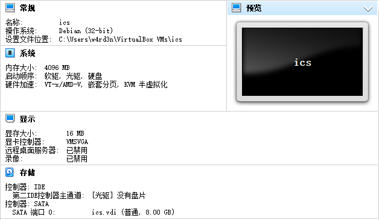

2. 加载光驱，打开虚拟机，然后一路按着文档选，中间由于我是连接网络安装，所以包管理器那里我选择了`China`和`mirrors.163.com`，且http代理为空。成功安装系统后`Virtual Box`自动移除光驱。

   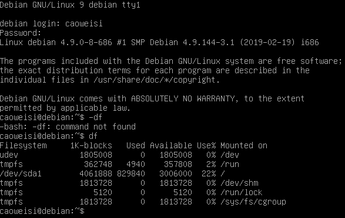

### PA0.2 First Step into Linux

1. 登录，实验命令行`df -h`，然后`poweroff`，提示无此命令，`su`切换到`root`，再次执行成功。

   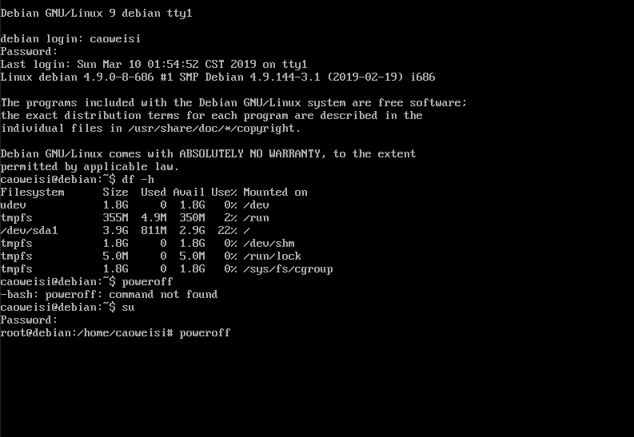

### PA0.3 Installing Basic Tools

1. 加载光驱，登录普通用户然后切换到`root`执行`apt-cdrom add`。

2. 安装`sudo`，执行`addgroup caoweisi sudo`使这个普通用户可以使用`sudo`。`exit`退出`root`然后再`exit`注销。

   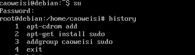

3. 安装`vim`和`openssh-server`，然后手动移除光驱并`sudo poweroff`。

   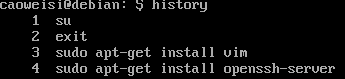

### PA0.4 Installing More Tools

1. 更换为桥接网络模式。（NAT模式没看到局域网的ip）

2. `ping 114.114.114.114 -c 4`成功，`ip addr`正常。

   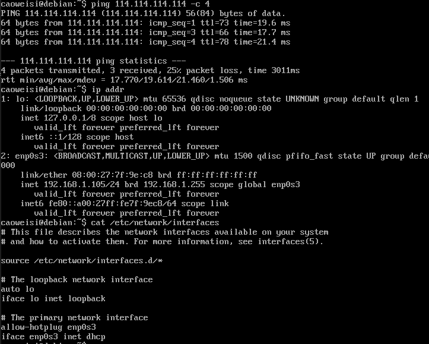

3. `sudo vim etc/apt/sources.list`换源。

   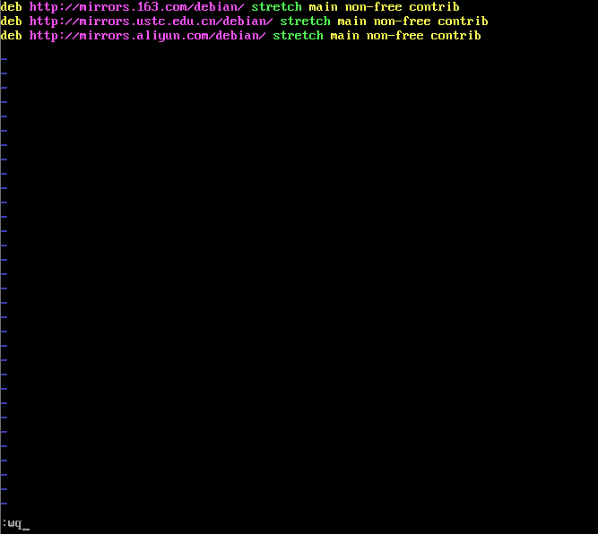

4. `sudo apt-get update`更新apt包管理器源。

   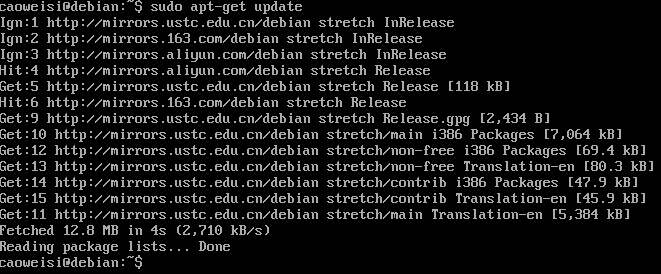

5. 安装一系列工具（就不一一截图了）。

### PA0.5 More Exploration

1. `cp /etc/vim/vimrc ~/.vimrc`，然后`vim .vimrc`来设置`vim`，此设置将对当前用户生效。

   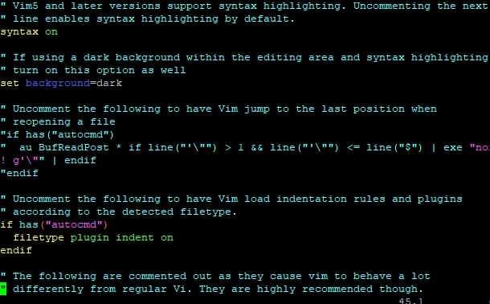

2. 写一个`helloworld`查询并编译运行。

   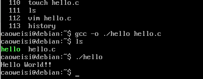

3. 学习使用`gdb`调试程序。

   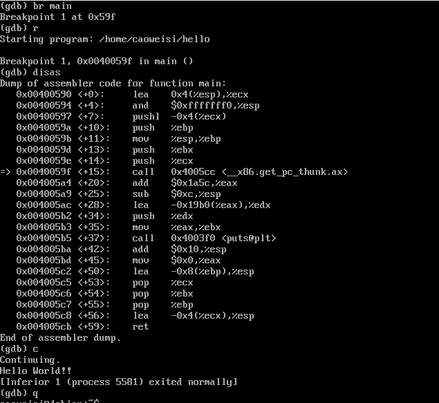

4. 学习使用`make`进行项目管理。

   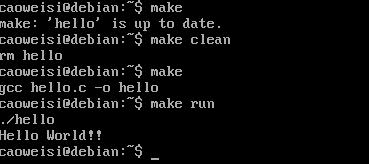

5. 与`NTP`服务器同步时间。

   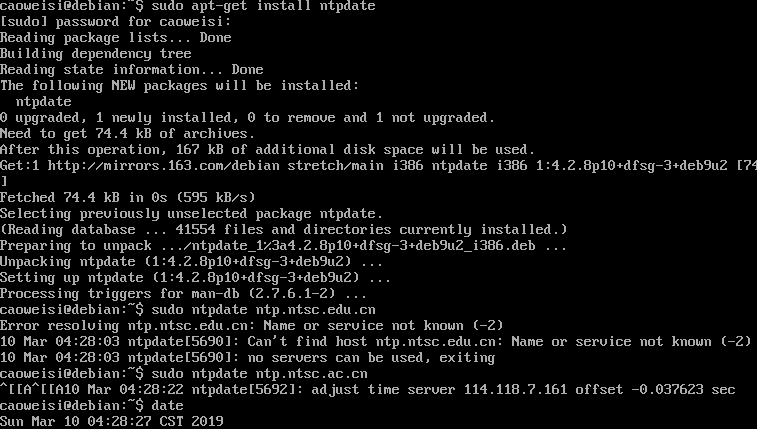

### PA0.6 Logging in and Transferring Files via SSH

1. `putty`连接虚拟机。

   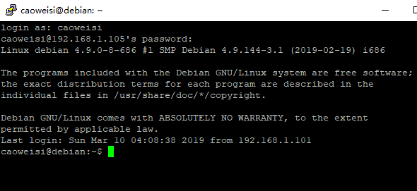

2. 使用`FileZilla`和虚拟机交换并修改文件。

   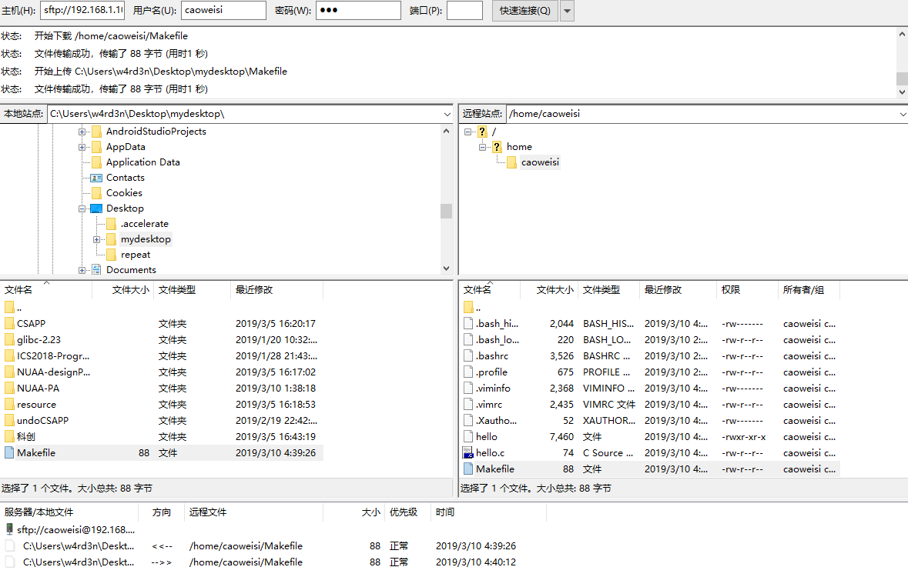

3. 配置`X Server`，运行`xclock`。

   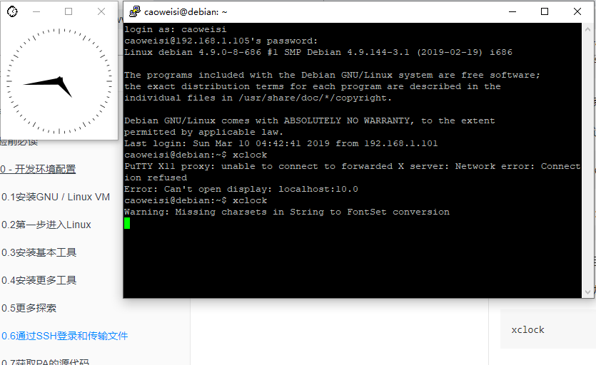

4. 备份`VM`。

### PA0.7 Acquiring Source Code for PAs

1. 使用`git`从远程仓库克隆项目到本地，更改`git`全局设置。进入项目文件夹输入`bash init.sh`初始化bash的环境变量。

   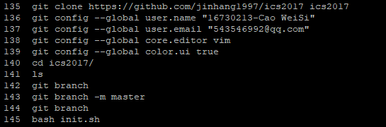

2. 新建并切换到分支`PA0`，修改`STU_ID`，使用`git status`查看修改状态，使用`git diff`查看修改细节，使用`git add .`将所有修改加入暂存区，使用`git commit`提交暂存区中的修改，最后使用`git log`查看所有提交简要。

   

3. 切回`master`分支发现`PA0`分支的操作并未对其产生影响。

4. 尝试`make`，`make clean`，`make run`，`make gdb`指令。`git log`发现开发跟踪功能正常。

5. `make submit`。

6. 推送`master`和`pa0`分支到远端仓库。

   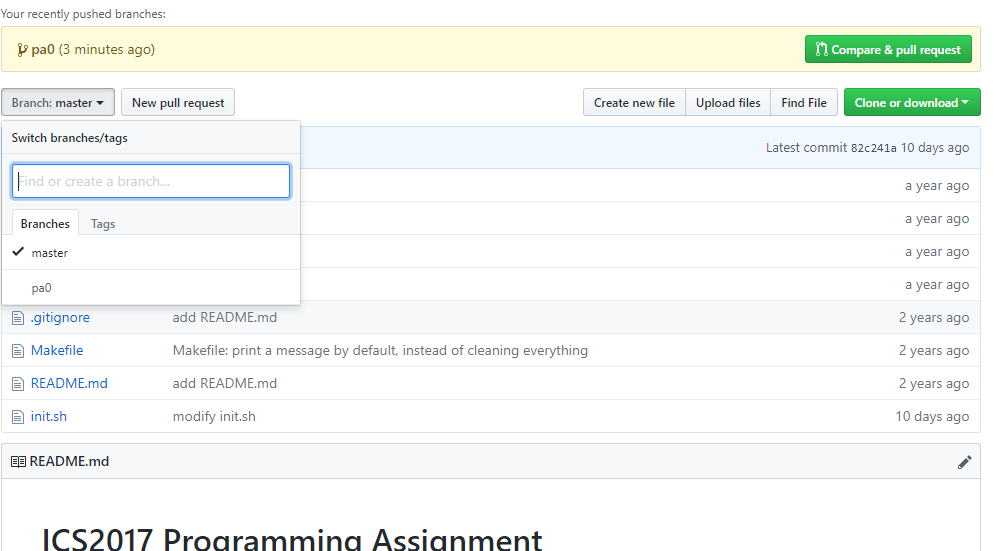

## 遇到的问题及解决办法

1. `PA0.5`部分的`sudo apt-get install libsdl2-dev`报错，发现是其依赖的一个包`libudev-dev`没安装。`sudo apt-get install libudev-dev`依旧报错，这次是`libudev-dev`依赖的`libudev1`版本不对。研究后发现原来是因为`libudev-dev`最新版本属于`security`，更新源成功安装

   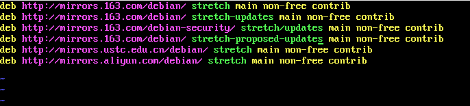

## 实验心得

`Linux`中大部分软件包括部分底层驱动都是可以根据需要更换的，包括内核版本，这就给予我们更大的选择。

脱离`IDE`之后才能发现更多底层的东西和原理。

版本管理是软件开发的瑞士军刀，而`git`是其中的佼佼者。

## 其他备注

无