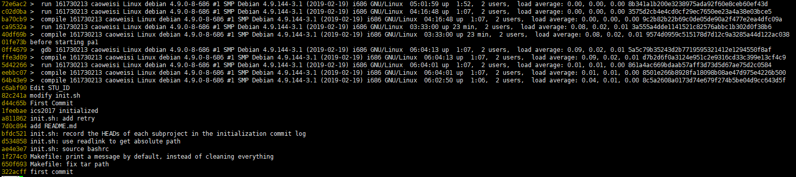

# 南京航空航天大学《计算机组成原理Ⅱ课程设计》报告

* 姓名：曹伟思
* 班级：1617302
* 学号：161730213
* 报告阶段：PA1.1
* 完成日期：2019.3.31
* 本次实验，我完成了所有内容。

## 目录

[TOC]

## 思考题

### 存放的是什么？

为什么是存放指令的存放地址而不是指令本身呢？

如果存放指令本身那么就无法知道下一条指令在哪。而存放指令的地址可以通过当前指令地址和当前指令长度得到下一条指令地址，从而一直执行下去。

### 贵圈真乱

```
+---------------------------------+ 
|      "Hello World" program      |
+---------------------------------+
|      Micro operating system     |
+---------------------------------+ 
|      Simulated x86 hardware     |
+---------------------------------+ 
|               NEMU              |
+---------------------------------+ 
|            GNU/Linux            |
+---------------------------------+ 
| VirtualBox (Simulated Hardware) |
+---------------------------------+ 
|      Host Operating System      |
+---------------------------------+ 
|        Computer hardware        |
+---------------------------------+
```

### 虚拟机和模拟器的区别

模拟器最大的特点，就是对寄存器级别的硬件单元和芯片内部的时钟信号进行抽象仿真，通常是为了模拟不同指令集、不同体系架构的`CPU`，即异构指令集，所以多数情况要对微指令进行解释执行。

模拟器是用软件来模拟硬件操作，一般所说的虚拟机里会用模拟器来实现`io`设备的虚拟化（内存和`CPU`的虚拟化一般是由`KVM`或`XEN`这种虚拟化平台来实现的）。

而虚拟机(这里指的是`VMware`,`Virtualbox`)最大的特点就是，代码中没有一行被用作寄存器级或时钟级的建模，主要焦点都放在如何在架构相同的硬件中模拟另一个操作系统运行时的环境。也可以归类为：异构\同构操作系统和同构指令集的环境。`virtualization`基本都是去模拟一套相同指令集相同架构的硬件平台，因此在做好保护的前提下，很多时候可以直接利用`CPU`去执行目标指令。

### 从哪开始阅读代码呢？

从`nemu/src/main.c`文件开始阅读。

### 究竟要执行多久？

在`cmd_c()`函数中，调用`cpu_exec()`的时候传入了参数`-1`，你知道为什么要这么做吗，并说明理由。

`cpu_exec()`的定义`void cpu_exec(uint64_t n)`，`-1`会被解释为`uint64_t`，也就是`0xffffffffffffffff`，所以就会`cpu_exec()`不断取指译码执行指令到程序结束。

### 谁来指示程序的结束？

在程序设计课上老师告诉你，当程序执行到`main()`函数返回处的时候,程序就退出了,你对此深信不疑。但你是否怀疑过，凭什么程序执行到`main()`函数的返回处就结束了？如果有人告诉你，程序设计课上老师的说法是错的，你有办法来证明/反驳吗？

一开始就不信，至少控制台不是我写的代码打开的（手动滑稽）。

以`elf64`为例，反汇编的结果表明操作系统在运行一个程序是会先新建一个进程并将程序加载到进程空间中，之后以`elf64`文件头的`e_entry`字段的值（一个虚拟地址）为程序入口，也就是`start`函数。


`start`函数初始化一部分参数后就调用`main`函数。`C++`中会在`main`函数之前先调用全局对象的构造函数，同理，结束之后调用全局对象的析构函数。

这些函数的调用取决于`ELF`文件中两个特殊的段。`.init`和`.fini`。

### 为什么会这样？

经过任务`4.1`和`4.2`，你发现本来是顺序存储的数据，为何以`4`字节为单位打印和以`1`字节为单位打印时相比，顺序会不一样？

这涉及存储对象内部的字节顺序，分为大端法（`IBM`和`Oracle`的大多数机器）和小端法（大多数`Intel`兼容机）。大端法即高字节数据存储在低地址中，低字节数据存放在高地址中。小端法与之相反。

实验环境下是小端法，而读取数据的代码`pmem_rw(addr, uint32_t) & (~0u >> ((4 - len) << 3));`是直接取`uint32_t`（小端法解释）返回。

## 实验内容

### 任务1：实现正确的寄存器结构体

实现在`nemu/include/cpu/reg.h`中的结构体`CPU_state`.

```c
typedef union {
  union {
    uint32_t _32;
    uint16_t _16;
    uint8_t _8[2];
  } gpr[8];

  /* Do NOT change the order of the GPRs' definitions. */

  /* In NEMU, rtlreg_t is exactly uint32_t. This makes RTL instructions
   * in PA2 able to directly access these registers.
   */
  struct {
    rtlreg_t eax;
    rtlreg_t ecx;
    rtlreg_t edx;
    rtlreg_t ebx;
    rtlreg_t esp;
    rtlreg_t ebp;
    rtlreg_t esi;
    rtlreg_t edi;
    vaddr_t eip;
  };
} CPU_state;
```

通过`union`访问同一个内存单位的不同长度的数据。通过`union`和匿名`struct`使`gpr[8]`和`8`个通用寄存器的内存单位一一对应。

先`make clean`，然后`make run`并`c`。


### 任务2.1：实现单步/指定步数执行功能

修改`cmd_table`（这里存储的使用来索引的指令信息或`handle`函数）。

```c
static struct {
  char *name;
  char *description;
  int (*handler) (char *);
} cmd_table [] = {
  { "help", "Display informations about all supported commands", cmd_help },
  { "c", "Continue the execution of the program", cmd_c },
  { "q", "Exit NEMU", cmd_q },
  { "si", "si [N]:Single-step execution N", cmd_si },
};
```

声明并定义函数`cmd_si`。

```c
static int cmd_si(char *args);

...

static int cmd_si(char *args){
  char *arg = strtok(NULL, " ");
  int N;

  if (arg == NULL) {
    N = 1;
  }
  else {
    N = atoi(arg);
  }

  cpu_exec(N);

  return 0;
}
```

先`make clean`，然后`make run`并`si 1`，`si`，`si -1`，`si 10`。


### 任务2.2：修改一次打印步数上限

看`cpu_exec`函数，发现实际运行使用的是`exec_wrapper(print_flag)`。

```c
for (; n > 0; n --) {
    /* Execute one instruction, including instruction fetch,
     * instruction decode, and the actual execution. */
    exec_wrapper(print_flag);
```

参数`print_flag`初始化`bool print_flag = n < MAX_INSTR_TO_PRINT;`。

先看`exec_wrapper`函数定义发现打印语句。

```c
if (print_flag) {
    puts(decoding.asm_buf);
}
```

所以是否打印由参数`print_flag`控制，其值为`n < MAX_INSTR_TO_PRINT`。所以修改上限即修改`MAX_INSTR_TO_PRINT`。

```c
#define MAX_INSTR_TO_PRINT -1
```

先`make clean`，然后`make run`并`si 5`，`si 10`，`si 15`。


### 任务3：实现打印寄存器功能

修改`cmd_table`。

```c
static struct {
  char *name;
  char *description;
  int (*handler) (char *);
} cmd_table [] = {
  { "help", "Display informations about all supported commands", cmd_help },
  { "c", "Continue the execution of the program", cmd_c },
  { "q", "Exit NEMU", cmd_q },
  { "si", "si [N]:Single-step execution N", cmd_si },
  { "info", "info r:print register status,info w:monitoring point information", cmd_info },
};
```

声明并定义函数`cmd_info`。

```c
static int cmd_info(char *args);

...

static int cmd_info(char *args){
  char *arg = strtok(NULL, " ");

  if (arg == NULL) {
    printf("info r:print register status,info w:monitoring point information\n");
  }
  else if (strcmp(arg,"r") == 0) {
    printf("eax %#010x %10d\n", cpu.eax, cpu.eax);
    printf("ecx %#010x %10d\n", cpu.ecx, cpu.ecx);
    printf("edx %#010x %10d\n", cpu.edx, cpu.edx);
    printf("ebx %#010x %10d\n", cpu.ebx, cpu.ebx);
    printf("esp %#010x %10d\n", cpu.esp, cpu.esp);
    printf("ebp %#010x %10d\n", cpu.ebp, cpu.ebp);
    printf("esi %#010x %10d\n", cpu.esi, cpu.esi);
    printf("edi %#010x %10d\n", cpu.edi, cpu.edi);
    printf("eip %#010x %10d\n", cpu.eip, cpu.eip);
  }
  else if (strcmp(arg,"w") == 0) {
    printf("'%s' is not finished\n", arg);
  }
  else {
    printf("Unknown command '%s'\n", arg);
  }

  return 0;
}
```

先`make clean`，然后`make run`并`info r`，`si 5`，`info r`。


### 任务4.1：实现扫描内存功能 && 任务4.2：转换为字节显示

修改`cmd_table`。

```c
static struct {
  char *name;
  char *description;
  int (*handler) (char *);
} cmd_table [] = {
  { "help", "Display informations about all supported commands", cmd_help },
  { "c", "Continue the execution of the program", cmd_c },
  { "q", "Exit NEMU", cmd_q },
  { "si", "si [N]:Single-step execution N", cmd_si },
  { "info", "info r:print register status,info w:monitoring point information", cmd_info },
  { "x", "x N EXPR:Find the value of the expression EXPR, use the result as the starting memory address, and output N consecutive 4 bytes in hexadecimal form", cmd_x },
};
```

声明并定义函数`cmd_x`和用于解析表达式的函数`parse_hex`（未完善）。

```c
static int cmd_x(char *args);

static vaddr_t parse_hex(char *args);

...

static vaddr_t parse_hex(char *arg){
  vaddr_t i = 0;
  char * end = arg + strlen(arg);

  for (char * x = arg + 2; x < end; x++) {
    if (*x >= '0' && *x <= '9') {
      i *= 0x10;
      i += *x - 0x30;
    }
    else if (*x >= 'a' && *x <= 'f') {
      i *= 0x10;
      i += *x - 0x57;
    }
    else if (*x >= 'A' && *x <= 'F') {
      i *= 0x10;
      i += *x - 0x37;
    }
    else {
      printf("EXPR error\n");
      return i;
    }
  }

  return i;
}

static int cmd_x(char *args){
  char *arg = strtok(NULL, " ");
  int N = 0;
  vaddr_t addr = 0;

  if (arg == NULL) {
    printf("N not found\n");
    return 0;
  }
  else {
    N = atoi(arg);
  }

  arg = strtok(NULL, " ");

  if (arg == NULL) {
    printf("EXPR not found\n");
    return 0;
  }
  else {
    addr = parse_hex(arg);
    printf("Address         Dword block     Byte sequence\n");
    while (N-- > 0) {
      uint32_t value = vaddr_read(addr, 4);
      uint32_t byte[4];
      byte[0] = value & 0x000000ff;
      byte[1] = (value & 0x0000ff00) >> 8;
      byte[2] = (value & 0x00ff0000) >> 16;
      byte[3] = (value >> 24) % 0x100;
      printf("%#010x      %#010x      %02x %02x %02x %02x\n", addr, value, byte[0], byte[1], byte[2], byte[3]);
      addr += 4;
    }
  }

  return 0;
}
```

先`make clean`，然后`make run`并`x 4 0x100000`。


### Git Log

`git log --oneline`截图。




## 遇到的问题及解决办法

`parse_hex`函数字符串处理时多处理了一位，导致程序报错，修改后解决

## 实验心得

深入理解计算机系统中的信息的表示和处理

## 其他备注

无