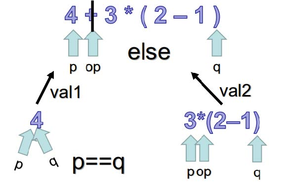
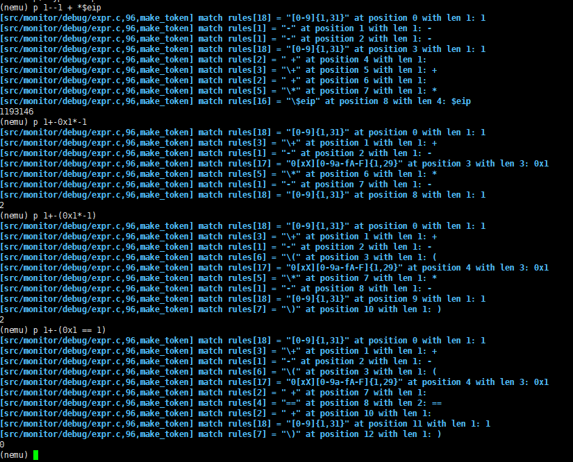
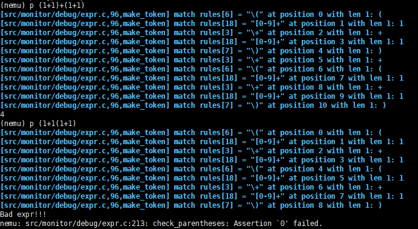
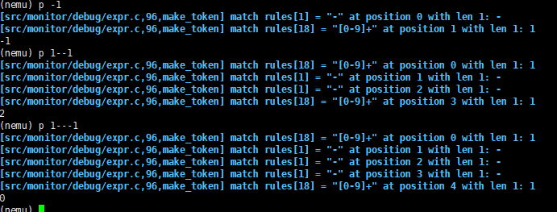
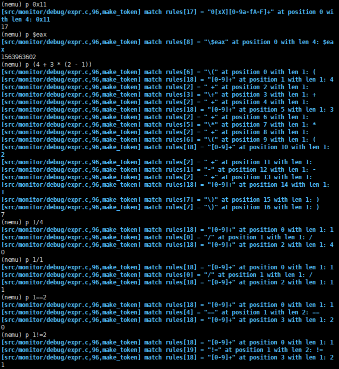
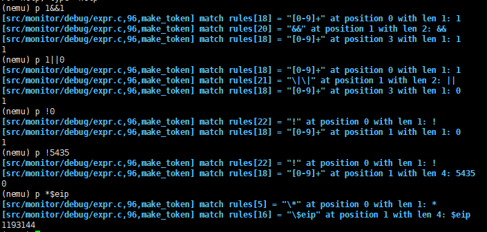
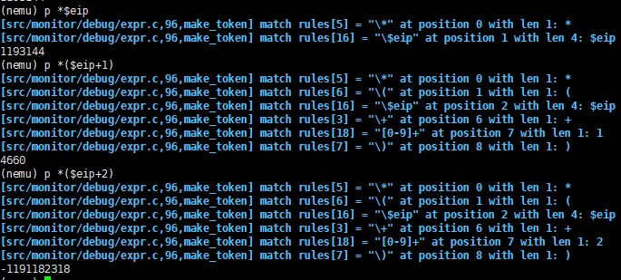
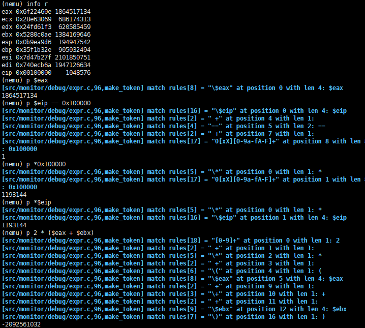
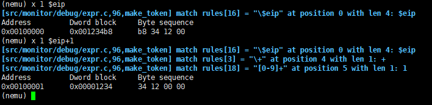

# 南京航空航天大学《计算机组成原理Ⅱ课程设计》报告

* 姓名：曹伟思
* 班级：1617302
* 学号：161730213
* 报告阶段：PA1.2
* 完成日期：2019.4.14
* 本次实验，我完成了所有内容并实现负数和x命令使用表达式求值。

## 目录

[TOC]

## 思考题

### 有什么办法？

使用栈分别保存操作符和数字然后计算求值,或者用分治法递归求值.

### 一些简单的正则表达式

答案:

1. `0x[0-9a-fA-F]{1,8}`(如果要匹配`0X`的就是`0[xX][0-9a-fA-F]{1,8}`).
2. `[0-9a-zA-Z]+`.
3. `[a-zA-Z]+[0-9a-zA-Z_]*`.
4. `[0-9]{9} - [\u4e00-\u9fa5]+ - PA1.1.pdf`(局限于普通学号).

### 这是为什么？

因为`C`语言的字符串里`\`也是转义字符要想在正则表达式里使用`\`转移其他的字符需要使用`\\`来获得字符串里的`\`字符.

### 如何处理以上的问题？

>需要注意的是, str成员的长度是有限的, 当你发现缓冲区将要溢出的时候, 要进行相应的处理(思考一下, 你会如何进行处理?)

在十进制数和十六进制数字符串复制之前判断长度是否大于`31`,如果大于直接`assert(0)`并告知错误原因.

### 递归求值的过程？

表达式可以分成一个数,两个子表达式的双目运算,单个子表达式的单目运算.

如果表达式中存在子表达式,那么对子表达式进行递归操作再运算即可.当表达式为一个数时终止递归并返回值.

(偷一下图)



## 实验内容

### 任务1：编写匹配规则(1)

按照正则表达式语法修改`rules`并在匿名`enum`里声明即可(要注意顺序,进行贪婪匹配).

```c
enum {
  TK_NOTYPE = 256,
  TK_EQ,
  TK_EAX,
  TK_EBX,
  TK_ECX,
  TK_EDX,
  TK_EDI,
  TK_ESI,
  TK_EBP,
  TK_ESP,
  TK_EIP,
  TK_DEC,
  TK_HEX,
  TK_NQ,
  TK_AND,
  TK_OR,
  TK_NO,
};

static struct rule {
  char *regex;
  int token_type;
} rules[] = {
  {"/", '/'},
  {"-", '-'},
  {" +", TK_NOTYPE},
  {"\\+", '+'},
  {"==", TK_EQ},
  {"\\*", '*'},
  {"\\(", '('},
  {"\\)", ')'},
  {"\\$eax", TK_EAX},
  {"\\$ebx", TK_EBX},
  {"\\$ecx", TK_ECX},
  {"\\$edx", TK_EDX},
  {"\\$edi", TK_EDI},
  {"\\$esi", TK_ESI},
  {"\\$ebp", TK_EBP},
  {"\\$esp", TK_ESP},
  {"\\$eip", TK_EIP},
  {"0[xX][0-9a-fA-F]+", TK_HEX},
  {"[0-9]+", TK_DEC},
  {"!=", TK_NQ},
  {"&&", TK_AND},
  {"\\|\\|", TK_OR},
  {"!", TK_NO},
};
```

### 任务2：为NEMU添加p命令

`PA1.1`做过类似的,直接贴代码.

```c
static int cmd_p(char * args);

static struct {
  char *name;
  char *description;
  int (*handler) (char *);
} cmd_table [] = {
  { "help", "Display informations about all supported commands", cmd_help },
  { "c", "Continue the execution of the program", cmd_c },
  { "q", "Exit NEMU", cmd_q },
  { "si", "si N:Single-step execution N, no N mean 1", cmd_si },
  { "info", "info r:print register status, info w:monitoring point information", cmd_info },
  { "x", "x N EXPR:Find the value of the expression EXPR as the starting memory address, output N consecutive 4 bytes in hexadecimal form", cmd_x },
  { "p", "p EXPR:output EXPR's value", cmd_p },
};

...

static int cmd_p(char * args){
  bool flag;
  printf("%d\n", expr(args, &flag));

  return 0;
}
```

### 任务3：存储匹配到的 token

完善`make_token`即可.

```c
static bool make_token(char *e) {
  int position = 0;
  int i;
  regmatch_t pmatch;

  nr_token = 0;

  while (e[position] != '\0') {
    for (i = 0; i < NR_REGEX; i ++) {
      if (regexec(&re[i], e + position, 1, &pmatch, 0) == 0 && pmatch.rm_so == 0) {
        char *substr_start = e + position;
        int substr_len = pmatch.rm_eo;

        Log("match rules[%d] = \"%s\" at position %d with len %d: %.*s",
            i, rules[i].regex, position, substr_len, substr_len, substr_start);
        position += substr_len;

        switch (rules[i].token_type) {
          case '+':
            tokens[nr_token].type = '+';
            break;
          case '/':
            tokens[nr_token].type = '/';
            break;
          case '-':
            tokens[nr_token].type = '-';
            break;
          case '*':
            tokens[nr_token].type = '*';
            break;
          case '(':
            tokens[nr_token].type = '(';
            break;
          case ')':
            tokens[nr_token].type = ')';
            break;
          case TK_NOTYPE:
            nr_token--;
            break;
          case TK_EQ:
            tokens[nr_token].type = TK_EQ;
            break;
          case TK_EAX:
            tokens[nr_token].type = TK_EAX;
            break;
          case TK_EBX:
            tokens[nr_token].type = TK_EBX;
            break;
          case TK_ECX:
            tokens[nr_token].type = TK_ECX;
            break;
          case TK_EDX:
            tokens[nr_token].type = TK_EDX;
            break;
          case TK_EDI:
            tokens[nr_token].type = TK_EDI;
            break;
          case TK_ESI:
            tokens[nr_token].type = TK_ESI;
            break;
          case TK_EBP:
            tokens[nr_token].type = TK_EBP;
            break;
          case TK_ESP:
            tokens[nr_token].type = TK_ESP;
            break;
          case TK_EIP:
            tokens[nr_token].type = TK_EIP;
            break;
          case TK_DEC:
            tokens[nr_token].type = TK_DEC;
            if (substr_len > 31) {
              printf("too long dec string(small than 31)\n");
              assert(0);
            }
            strncpy(tokens[nr_token].str, substr_start, substr_len);
            tokens[nr_token].str[substr_len] = '\0';
            break;
          case TK_HEX:
            tokens[nr_token].type = TK_HEX;
            if (substr_len > 31) {
              printf("too long hex string(small than 31)\n");
              assert(0);
            }
            strncpy(tokens[nr_token].str, substr_start, substr_len);
            tokens[nr_token].str[substr_len] = '\0';
            break;
          case TK_NQ:
            tokens[nr_token].type = TK_NQ;
            break;
          case TK_AND:
            tokens[nr_token].type = TK_AND;
            break;
          case TK_OR:
            tokens[nr_token].type = TK_OR;
            break;
          case TK_NO:
            tokens[nr_token].type = TK_NO;
            break;
          default:
            assert(0);
        }
        nr_token++;

        break;
      }
    }

    if (i == NR_REGEX) {
      printf("no match at position %d\n%s\n%*.s^\n", position, e, position, "");
      return false;
    }
  }

  return true;
}
```

补一下图.



### 任务4：实现括号匹配

重点是两边左右括号不能和里面的左右括号匹配.从左边扫描的话判断右括号.

```c
bool check_parentheses(int p, int q){
  if (tokens[p].type == '(' && tokens[q].type == ')') {
    int flag = 0;
    while (++p < q) {
      if (tokens[p].type == ')' && !flag) {
        return false;
      } else if (tokens[p].type == ')') {
        flag--;
      } else if (tokens[p].type == '(') {
        flag++;
      }
    }
    if (flag) {
      printf("Bad expr!!!\n");
      assert(0);
    }
  } else {
    return false;
  }
  
  return true;
}
```

补一下图.



### 任务5：寻找当前子表达式的中心操作符

定义一个优先级变量`q_level`,对于结合性从右到左的使用`<=`判断优先级,对于结合性从左到右的使用`<`判断优先级.

```c
uint32_t find_dominant_operator(int p, int q) {
  int flag = 0;
  uint32_t q_now = -1;
  uint32_t q_level = 0;
  while (p <= q) {
    if (flag > 0) {
      assert(0);
    }
    switch (tokens[q].type) {
      case '+':
        if (flag == 0 && q_level < 4) {
          q_level = 4;
          q_now = q;
        }
        break;
      case '/':
        if (flag == 0 && q_level < 3) {
          q_level = 3;
          q_now = q;
        }
        break;
      case '-':
        if (q > 0) {
          switch (tokens[q - 1].type) {
            case '+':
            case '/':
            case '-':
            case '*':
            case '(':
            case TK_NQ:
            case TK_AND:
            case TK_OR:
            case TK_NO:
            case TK_EQ:
              if (flag == 0 && q_level <= 2) {
                q_level = 2;
                q_now = q;
              }
              break;
            case ')':
            case TK_EAX:
            case TK_EBX:
            case TK_ECX:
            case TK_EDX:
            case TK_EDI:
            case TK_ESI:
            case TK_EBP:
            case TK_ESP:
            case TK_EIP:
            case TK_DEC:
            case TK_HEX:
              if (flag == 0 && q_level < 4) {
                q_level = 4;
                q_now = q;
              }
              break;
            default:
              assert(0);
          }
        } else {
          if (flag == 0 && q_level <= 2) {
            q_level = 2;
            q_now = q;
          }
        }
        break;
      case '*':
        if (q > 0) {
          switch (tokens[q - 1].type) {
            case '+':
            case '/':
            case '-':
            case '*':
            case '(':
            case TK_NQ:
            case TK_AND:
            case TK_OR:
            case TK_NO:
            case TK_EQ:
              if (flag == 0 && q_level <= 2) {
                q_level = 2;
                q_now = q;
              }
              break;
            case ')':
            case TK_EAX:
            case TK_EBX:
            case TK_ECX:
            case TK_EDX:
            case TK_EDI:
            case TK_ESI:
            case TK_EBP:
            case TK_ESP:
            case TK_EIP:
            case TK_DEC:
            case TK_HEX:
              if (flag == 0 && q_level < 3) {
                q_level = 3;
                q_now = q;
              }
              break;
            default:
              assert(0);
          }
        } else {
          if (flag == 0 && q_level <= 2) {
            q_level = 2;
            q_now = q;
          }
        }
        break;
      case TK_EQ:
        if (flag == 0 && q_level < 7) {
          q_level = 7;
          q_now = q;
        }
        break;
      case '(':
        flag++;
        break;
      case ')':
        flag--;
        break;
      case TK_NQ:
        if (flag == 0 && q_level < 7) {
          q_level = 7;
          q_now = q;
        }
        break;
      case TK_AND:
        if (flag == 0 && q_level < 11) {
          q_level = 11;
          q_now = q;
        }
        break;
      case TK_OR:
        if (flag == 0 && q_level < 12) {
          q_level = 12;
          q_now = q;
        }
        break;
      case TK_NO:
        if (flag == 0 && q_level <= 2) {
          q_level = 2;
          q_now = q;
        }
        break;
      case TK_EAX:
        break;
      case TK_EBX:
        break;
      case TK_ECX:
        break;
      case TK_EDX:
        break;
      case TK_EDI:
        break;
      case TK_ESI:
        break;
      case TK_EBP:
        break;
      case TK_ESP:
        break;
      case TK_EIP:
        break;
      case TK_DEC:
        break;
      case TK_HEX:
        break;
      default:
        assert(0);
    }
    q--;
  }

  return q_now;
}
```

这里就不贴图了,前面的体现了优先性(或者看下个任务的图也行).

### 选做任务：带有负数的表达式求值

这里其实只需要判断`-`的前一个`token`的类型是不是值(寄存器,十六进制数或十进制数或者右括号)即可,因为`-`作为负号是一元运算符,而作为减号是二元运算符(其他一元运算符同理,这也是为什么`C`语言自带的运算符重载以操作元数量为标签).

```c
case '-':
  if (q > 0) {
    switch (tokens[q - 1].type) {
      case '+':
      case '/':
      case '-':
      case '*':
      case '(':
      case TK_NQ:
      case TK_AND:
      case TK_OR:
      case TK_NO:
      case TK_EQ:
        if (flag == 0 && q_level <= 2) {
          q_level = 2;
          q_now = q;
        }
        break;
      case ')':
      case TK_EAX:
      case TK_EBX:
      case TK_ECX:
      case TK_EDX:
      case TK_EDI:
      case TK_ESI:
      case TK_EBP:
      case TK_ESP:
      case TK_EIP:
      case TK_DEC:
      case TK_HEX:
        if (flag == 0 && q_level < 4) {
          q_level = 4;
          q_now = q;
        }
        break;
      default:
        assert(0);
    }
  } else {
    if (flag == 0 && q_level <= 2) {
      q_level = 2;
      q_now = q;
    }
  }
  break;
```

补一下图.



### 任务6：编写匹配规则(2)

之前代码中已经全部完成,按照`C`语言中运算符的优先级和结合性编写即可.

补一下图.





### 任务7：实现指针解引用

更新`find_dominant_operator`即可.

```c
case '*':
  if (q > 0) {
    switch (tokens[q - 1].type) {
      case '+':
      case '/':
      case '-':
      case '*':
      case '(':
      case TK_NQ:
      case TK_AND:
      case TK_OR:
      case TK_NO:
      case TK_EQ:
        if (flag == 0 && q_level <= 2) {
          q_level = 2;
          q_now = q;
        }
        break;
      case ')':
      case TK_EAX:
      case TK_EBX:
      case TK_ECX:
      case TK_EDX:
      case TK_EDI:
      case TK_ESI:
      case TK_EBP:
      case TK_ESP:
      case TK_EIP:
      case TK_DEC:
      case TK_HEX:
        if (flag == 0 && q_level < 3) {
          q_level = 3;
          q_now = q;
        }
        break;
      default:
        assert(0);
    }
  } else {
    if (flag == 0 && q_level <= 2) {
      q_level = 2;
      q_now = q;
    }
  }
  break;
```

补一下图.



### 总任务：实现表达式求值

对于寄存器之间返回值,十进制数和十六进制数要通过字符串转化获得其数值,然后用`BNF`递归求值即可,对于先检测是否为一元运算符,在进行二元运算符的计算(符合优先性).

```c
uint32_t eval(int p, int q) {
  if (p > q) {
    printf("p > q");
    assert(0);
  }
  else if (p == q) {
    uint32_t i = 0;
    char * end;
    switch (tokens[q].type) {
      case TK_EAX:
        return cpu.eax;
      case TK_EBX:
        return cpu.ebx;
      case TK_ECX:
        return cpu.ecx;
      case TK_EDX:
        return cpu.edx;
      case TK_EDI:
        return cpu.edi;
      case TK_ESI:
        return cpu.esi;
      case TK_EBP:
        return cpu.ebp;
      case TK_ESP:
        return cpu.esp;
      case TK_EIP:
        return cpu.eip;
      case TK_DEC:
        return atoi(tokens[p].str);
      case TK_HEX:
        end = tokens[p].str + strlen(tokens[p].str);

        for (char * x = tokens[p].str + 2; x < end; x++) {
          if (*x >= '0' && *x <= '9') {
            i *= 0x10;
            i += *x - 0x30;
          }
          else if (*x >= 'a' && *x <= 'f') {
            i *= 0x10;
            i += *x - 0x57;
          }
          else if (*x >= 'A' && *x <= 'F') {
            i *= 0x10;
            i += *x - 0x37;
          }
          else {
            printf("EXPR error\n");
          }
        }
        return i;
      default:
        assert(0);
    }
  }
  else if (check_parentheses(p, q) == true) {
    return eval(p + 1, q - 1);
  }
  else {
    uint32_t op, val1, val2;
    op = find_dominant_operator(p, q);
    if (op == p) {
      switch (tokens[op].type) {
        case '-': return -eval(op + 1, q);
        case TK_NO: return !eval(op + 1, q);
        case '*': return vaddr_read(eval(op + 1, q), 4);
        default: assert(0);
      }
    }
    val1 = eval(p, op - 1);
    val2 = eval(op + 1, q);
    switch (tokens[op].type) {
      case '+': return val1 + val2;
      case '-': return val1 - val2;
      case '*': return val1 * val2;
      case '/': return val1 / val2;
      case TK_EQ: return val1 == val2;
      case TK_NQ: return val1 != val2;
      case TK_AND: return val1 && val2;
      case TK_OR: return val1 || val2;
      default: assert(0);
    }
  }

  return 0;
  //不会被执行
}

uint32_t expr(char *e, bool *success) {
  if (!make_token(e)) {
    *success = false;
    return 0;
  }

  return eval(0, nr_token - 1);
}

```

补一下图.



### 实现x命令使用表达式求值

直接使用`expr`.

补一下图.



## 遇到的问题及解决办法

1. `rules`数组里如果十进制数的表达式在十六进制前面会导致十六进制匹配失败,因为`0`会被先匹配成十进制数,按照贪婪原则应将十六进制匹配放前面.其他同理.
2. 单元运算符`-`,`*`和`!`结合性为从右到左,所以这里和之前的加减乘除不一样,要匹配最左边的(先匹配的后运算),开始因为这个负数求值那里卡了半天.

## 实验心得

深入理解递归求值,词法分析和`C`语言运算符优先性.

## 其他备注

一开始的代码是在另一台笔记本上写的(只装了`64bitUbuntu`),然后`make run`里的`compile`和`run`的记录有一部分没拿过来.因为我是直接把两个文件复制过来的.