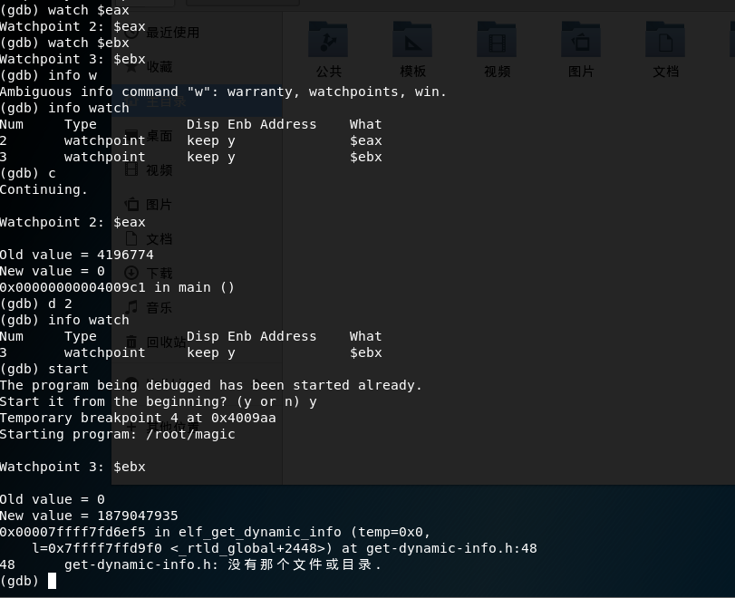
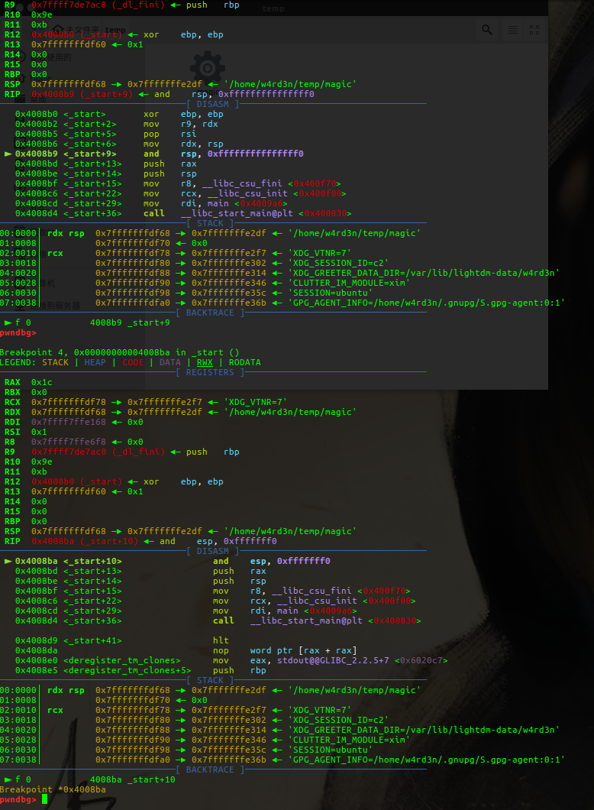
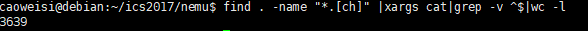
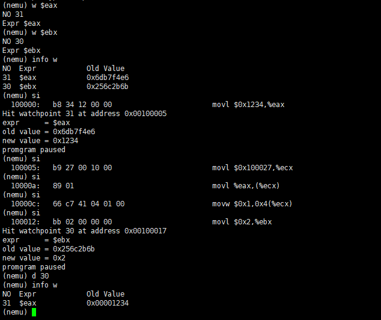
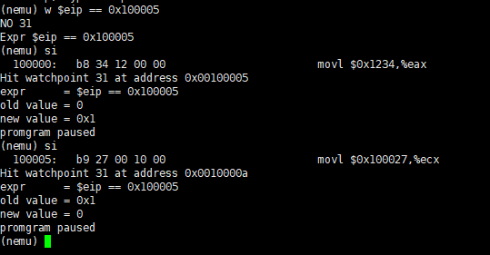
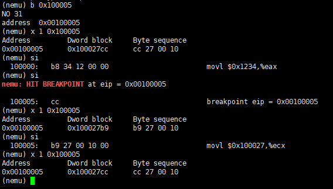

# 南京航空航天大学《计算机组成原理Ⅱ课程设计》报告

* 姓名：曹伟思
* 班级：1617302
* 学号：161730213
* 报告阶段：PA1.3
* 完成日期：2019.4.18
* 本次实验，我完成了所有内容并实现软件断点。

## 目录

[TOC]

## 思考题

### 体验监视点



### 科学起名

`C`语言`stdlib.h`中定义了`free`函数,所以全局变量名不能叫`free`.

### 温故而知新

这里的`static`主要声明了文件作用域,使全局变量变成静态全局变量,全局变量和静态全局变量在存储方式上并无不同.区别在于非静态全局变量的作用域是整个源程序,当一个源程序由多个源文件组成时,非静态的全局变量在各个源文件中都是有效的.而静态全局变量则限制了其作用域,即只在定义该变量的源文件内有效,在同一源程序的其它源文件中不能使用它.

### 一点也不能长？

这种单字节形式很有价值,因为它可用于用断点替换任何指令的第一个字节,包括其他一个字节指令,而不会覆盖其他代码.

### "随心所欲"的断点

如果不是指令第一个字节的地址可能会产生新的指令.



### NEMU的前世今生

模拟器(`Emulator`)是用于模拟一个系统内部并实现其功能的软件,而调试器(`Debugger`)只是单纯的使用操作系统包括硬件本身提供的接口.

调试器能够随心所欲的停止程序的执行,主要通过软件断点和硬件断点两种方式.

软件断点在`X86`系统中就是指令`INT 3`,它的二进制代码`opcode`是`0xCC`.当程序执行到`INT 3`指令时,会引发软件中断.操作系统的`INT 3`中断处理器会寻找注册在该进程上的调试处理程序.
硬件断点,`X86`系统提供8个调试寄存器(`DR0~DR7`)和`2`个`MSR`用于硬件调试.其中前四个`DR0~DR3`是硬件断点寄存器,可以放入内存地址或者`IO`地址,还可以设置为执行,修改等条件.`CPU`在执行的到这里并满足条件会自动停下来.

硬件断点十分强大,但缺点是只有四个,这也是为什么所有调试器的硬件断点只能设置`4`个原因.我们在调试不能修改的`ROM`时,只能选择这个,所以要省着点用,在一般情况下还是尽量选择软件断点.

### 尝试通过目录定位关注的问题


### 理解基础设施

调试是找出`bug`最有效也是最轻松的方式,信息是最重要的武器.

### 查阅i386手册

答案:

1. 首先从目录定位到章节`2.3.4:Flags Register`,在子部分`Status Flags`中找到定义:`There are instructions to set, clear, and complement CF before execution of an arithmetic instruction. Refer to Appendix C for definition of each status flag.`(`p34`)
2. 首先从目录定位到章节`17.2.1:ModR/M and SIB Bytes`,在子部分`The ModR/M byte contains three fields of information`中找到定义.(`p241-p242`)
3. 关键词指令和`mov`定位到章节`17.2.2.11:Instruction Set Detail`的子部分下.(`p345-p351`)

### shell命令

```bash
find . -name "*.[ch]" |xargs cat|grep -v ^$|wc -l
#先获取需要统计的文件名再使用xargs过滤器当做参数传给cat,将输出内容传给grep过滤最后使用wc -l统计行数.
```



### 使用man

`-Werror:Make all warnings into errors`.
`-Wall:This enables all the warnings about constructions that some users consider questionable, and that are easy to avoid (or modify to prevent the warning), even in conjunction with macros. This also enables some language-specific warnings described in C++ Dialect Options and Objective-C and Objective-C++ Dialect Options.`

使用`man`的`/string`搜索功能检索.

## 实验内容

### 任务1：实现监视点结构体

修改`watchpoint.h`即可,后面实现软件断点时添加了`type`变量,实现方法时增加了引用声明.

`watchpoint.h`.

```c
#ifndef __WATCHPOINT_H__
#define __WATCHPOINT_H__

#include "common.h"

typedef struct watchpoint
{
  int NO;
  struct watchpoint *next;
  char expr[32];
  uint32_t new_val;
  uint32_t old_val;
  uint8_t type;
  //0 is watchpoint, 1 is breakpoint.
} WP;

WP *new_wp();
void free_wp(WP *wp);
int set_watchpoint(char *e);
bool delete_watchpoint(int NO);
void list_watchpoint(void);
WP *scan_watchpoint(void);
int set_breakpoint(char *e);
void recover_int3();

#endif
```

### 任务2：实现监视点池的管理

基础的链表插入,删除操作.

```c
WP *new_wp()
{
  if (!free_)
    assert(0);
  WP *last = NULL;
  WP *now = free_;
  while (now->next)
  {
    last = now;
    now = now->next;
  }
  if (last)
    last->next = NULL;
  else
    free_ = NULL;

  last = head;
  if (last)
  {
    while (last->next)
    {
      last = last->next;
    }
    last->next = now;
  }
  else
  {
    head = now;
  }

  return now;
}

void free_wp(WP *wp)
{
  WP *now = head;
  if (head == wp)
  {
    head = head->next;
    wp->next = NULL;
    now = free_;
    if (!free_)
    {
      free_ = wp;
    }
    else
    {
      while (now->next)
      {
        now = now->next;
      }
      now->next = wp;
    }
  }
  else
  {
    while (now && now->next != wp)
    {
      now = now->next;
    }
    if (now)
    {
      now->next = wp->next;
      wp->next = NULL;
      now = free_;
      if (!free_)
      {
        free_ = wp;
      }
      else
      {
        while (now->next)
        {
          now = now->next;
        }
        now->next = wp;
      }
    }
  }
}
```

### 任务3：将监视点加入调试器功能

修改`ui.c`.

```c
static int cmd_w(char *args);

static int cmd_b(char *args);

static int cmd_d(char *args);

static struct
{
  char *name;
  char *description;
  int (*handler)(char *);
} cmd_table[] = {
    {"help", "Display informations about all supported commands", cmd_help},
    {"c", "Continue the execution of the program", cmd_c},
    {"q", "Exit NEMU", cmd_q},
    {"si", "si N:Single-step execution N, no N mean 1", cmd_si},
    {"info", "info r:print register status, info w:list watchpoint information", cmd_info},
    {"x", "x N EXPR:Find the value of EXPR as the starting memory address, output N consecutive 4 bytes in hexadecimal form", cmd_x},
    {"p", "p EXPR:output EXPR's value", cmd_p},
    {"w", "w EXPR:set a watchpoint for EXPR", cmd_w},
    {"b", "b EXPR:set a breakpoint for eip as the value of EXPR", cmd_b},
    {"d", "d NO:delete a watchpoint for NO", cmd_d},
};

...

static int cmd_info(char *args)
{
  char *arg = strtok(NULL, " ");

  if (arg == NULL)
  {
    //code
  }
  else if (strcmp(arg, "r") == 0)
  {
    //code
  }
  else if (strcmp(arg, "w") == 0)
  {
    list_watchpoint();
  }
  else
  {
    //code  
  }

  return 0;
}

static int cmd_w(char *args)
{
  if (strlen(args) > 31)
  {
    printf("too long EXPR\n");
    return 0;
  }
  int NO = set_watchpoint(args);
  printf("NO %d\nExpr %s\n", NO, args);

  return 0;
}

static int cmd_b(char *args)
{
  bool flag;
  int NO = set_breakpoint(args);
  printf("NO %d\naddress  %#010x\n", NO, expr(args, &flag));

  return 0;
}

static int cmd_d(char *args)
{
  int NO = atoi(args);
  delete_watchpoint(NO);

  return 0;
}
```

具体功能实现与截图在任务`4`.

### 任务4：实现监视点

基础的遍历链表操作,`scan_watchpoint`多个监视点一起触发只报警第一个.

```c
int set_watchpoint(char *e)
{
  bool flag;
  WP *wp = new_wp();
  wp->old_val = expr(e, &flag);
  wp->type = 0;
  strcpy(wp->expr, e);

  return wp->NO;
}

bool delete_watchpoint(int NO)
{
  WP *wp = head;
  while (wp && wp->NO != NO)
  {
    wp = wp->next;
  }
  if (wp->NO == NO)
  {
    free_wp(wp);
    return true;
  }
  else
  {
    printf("NO %d watchpoint/breakpoint not found\n", NO);
    return false;
  }
}

void list_watchpoint(void)
{
  printf("NO  Expr            Old Value\n");
  WP *now = head;
  while (now)
  {
    if (now->type == 0)
    {
      printf("%2d  %-16s%#010x\n", now->NO, now->expr, now->old_val);
      break;
    }
    now = now->next;
  }
}

WP *scan_watchpoint(void)
{
  bool flag;
  WP *now = head;
  while (now)
  {
    if (now->type)
    {
      if (now->new_val == 1)
      {
        cpu.eip -= 1;
        now->new_val = 2;
      }
      else if (now->new_val == 2)
      {
        *now->expr = *(char *)guest_to_host(now ->old_val);
        *(char *)guest_to_host(now->old_val) = 0xcc;
      }
      //恢复断点.
      now = now->next;
      continue;
    }
    else if (now->old_val != expr(now->expr, &flag))
    {
      printf("Hit watchpoint %d at address %#010x\n", now->NO, cpu.eip);
      printf("expr      = %s\n", now->expr);
      printf("old value = %#x\n", now->old_val);
      printf("new value = %#x\n", expr(now->expr, &flag));
      printf("promgram paused\n");
      nemu_state = NEMU_STOP;
      now->old_val = expr(now->expr, &flag);
      return now;
    }
    now = now->next;
  }

  return NULL;
}
```

在`cpu-exec.c`的`cpu_exec`函数调用`scan_watchpoint`.

```c
void cpu_exec(uint64_t n)
{
  if (nemu_state == NEMU_END)
  {
    printf("Program execution has ended. To restart the program, exit NEMU and run again.\n");
    return;
  }
  nemu_state = NEMU_RUNNING;

  bool print_flag = n < MAX_INSTR_TO_PRINT;

  for (; n > 0; n--)
  {
    /* Execute one instruction, including instruction fetch,
     * instruction decode, and the actual execution. */
    exec_wrapper(print_flag);

#ifdef DEBUG
    if (scan_watchpoint())
      return;
#endif

#ifdef HAS_IOE
    extern void device_update();
    device_update();
#endif

    if (nemu_state != NEMU_RUNNING)
    {
      return;
    }
  }

  if (nemu_state == NEMU_RUNNING)
  {
    nemu_state = NEMU_STOP;
  }
}
```

贴一下图.



### 任务5：使用模拟断点



这种实现方式会在`eip`到指定值之时和之后都触发一次,十分不方便.

### 选做任务：实现软件断点

首先为了实现这个单字节操作码,先找到模拟`cpu`运行的逻辑,也就是`cpu_exec`,往下找一层找到`exec_wrapper`.这个函数输出调试信息和运行.

其中运行的语句为:

```c
decoding.seq_eip = cpu.eip;
exec_real(&decoding.seq_eip);
```

`exec_real`这个函数一开始没找到,仔细`RTFSC`后发现这些`exec_`开头的函数的函数名都是用`C`语言宏的`#`字符组合出来的,而具体的宏如下:

```c
#define make_EHelper(name) void concat(exec_, name) (vaddr_t *eip)
```

所以`exec_real`的定义如下:

```c
make_EHelper(real) {
  uint32_t opcode = instr_fetch(eip, 1);
  decoding.opcode = opcode;
  set_width(opcode_table[opcode].width);
  idex(eip, &opcode_table[opcode]);
}
```

执行逻辑在`idex`里面.

```c
static inline void idex(vaddr_t *eip, opcode_entry *e) {
  /* eip is pointing to the byte next to opcode */
  if (e->decode)
    e->decode(eip);
  e->execute(eip);
}
```

`opcode_entry`的定义.

```c
typedef struct {
  DHelper decode;
  EHelper execute;
  int width;
} opcode_entry;
//decode.h: typedef void (*DHelper) (vaddr_t *);
//exec.h: typedef void (*EHelper) (vaddr_t *);
```

然后就找到了对应的数组`opcode_table`.

找到单字节`0xcc`的位置,按照宏定义使用`EX()`宏设置`0xcc`操作码.(取名为`int3`)

```c
{
    ...
/* 0xcc */  EX(int3), EMPTY, EMPTY, EMPTY,
    ...
}
```

在`system.c`中定义.

```c
make_EHelper(int3) {
  print_asm("breakpoint eip = %0#10x", cpu.eip);
  printf("\33[1;31mnemu: HIT BREAKPOINT\33[0m at eip = %0#10x\n\n", cpu.eip);
  recover_int3();
  nemu_state = NEMU_STOP;
}
```

`recover_int3()`定义于`watchpoint.c`(因为要操作`head`指针).

```c
void recover_int3()
{
  WP *now = head;
  while (now)
  {
    if (now->type == 1 && now->old_val == cpu.eip)
    {
      *(char *)guest_to_host(now->old_val) = *now->expr;
      now->new_val = 1;
      break;
    }
    now = now->next;
  }
}
```

修改`ui.c`增加`b`指令(代码在任务`3`),增加`set_breakpoint`于`watchpoint.c`.

```c
int set_breakpoint(char *e)
{
  bool flag;
  WP *wp = new_wp();
  wp->old_val = expr(e, &flag);
  wp->new_val = 0;
  wp->type = 1;
  *wp->expr = *(char *)guest_to_host(wp->old_val);
  *(char *)guest_to_host(wp->old_val) = 0xcc;

  return wp->NO;
}
```

贴一下图.



## 遇到的问题及解决办法

无

## 实验心得

深入理解监视点,软件断点和`C`语言宏.

## 其他备注

无.