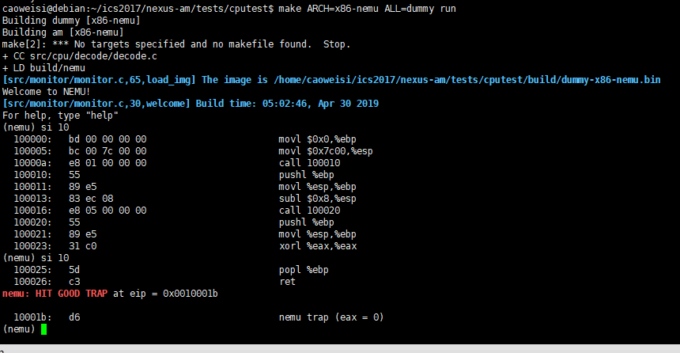
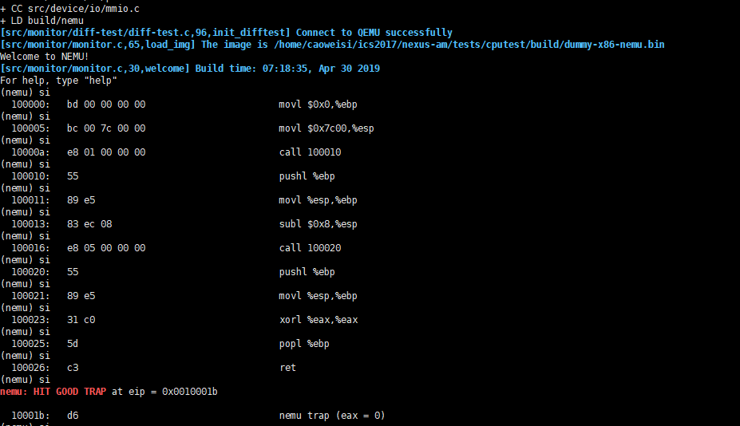

# 南京航空航天大学《计算机组成原理Ⅱ课程设计》报告

* 姓名：曹伟思
* 班级：1617302
* 学号：161730213
* 报告阶段：PA2.1
* 完成日期：2019.4.30
* 本次实验，我完成了所有内容。

## 目录

[TOC]

## 思考题

### 增加了多少

包括了一条指令的前缀,操作码,操作数.

### 是什么类型？

表中表项为`opcode_entry`,这个结构体定义如下.

```c
typedef struct {
  DHelper decode;  
  //译码函数指针
  //typedef void (*DHelper) (vaddr_t *);
  EHelper execute;
  //执行函数指针
  //typedef void (*EHelper) (vaddr_t *);
  int width;
  //操作数长度
} opcode_entry;
```

### 操作数结构体的实现

操作数结构体定义如下.

```c
typedef struct {
  uint32_t type;
  //操作数类型
  int width;
  //操作数长度
  union {
    uint32_t reg;
    //寄存器寻值使用
    rtlreg_t addr;
    //内存寻值使用
    uint32_t imm;
    //无符号立即数使用
    int32_t simm;
    //有符号立即数使用
  };
  //使用联合使不同种类操作数复用内存
  rtlreg_t val;
  //操作数解码后的值
  char str[OP_STR_SIZE];
  //操作数的字符串表达
} Operand;
```

### 复现宏定义

```c
make_EHelper(mov) = void concat(exec_, mov) (vaddr_t *eip) = void concat_temp(exec_, mov) (vaddr_t *eip) = void exec_mov (vaddr_t *eip)
make_EHelper(push) = void concat(exec_, push) (vaddr_t *eip) = void concat_temp(exec_, push) (vaddr_t *eip) = void exec_push (vaddr_t *eip)
make_DHelper(I2r) = void concat(decode_, I2r) (vaddr_t *eip) = void concat_temp(decode_, I2r) (vaddr_t *eip) = void decode_I2r (vaddr_t *eip)
IDEX(I2a, cmp) = IDEXW(I2a, cmp, 0) = {concat(decode_, I2a), concat(exec_, cmp), 0} = {concat_temp(decode_, I2a), concat_temp(exec_, cmp), 0} = {decode_I2a, exec_cmp, 0}
EX(nop) = EXW(nop, 0) = {NULL, concat(exec_, nop), 0} = {NULL, concat_temp(exec_, nop), 0} = {NULL, exec_nop, 0}
make_rtl_arith_logic(and)
=
static inline void rtl_and (rtlreg_t* dest, const rtlreg_t* src1, const rtlreg_t* src2) { *dest = c_and (*src1, *src2); }
static inline void rtl_andi (rtlreg_t* dest, const rtlreg_t* src1, int imm) { *dest = c_and (*src1, imm); }
```

### 立即数背后的故事

需要注意大小端序的问题,因为大端序以低字节为高位,与小端序正好相反,第一种情况我们需要在`instr_fetch`读字节序列时逆序放入存储变量中.而第二种情况我们在内存中的立即数应该为大端序,同理取出时我们需要逆序存储到变量中.

### 神奇的eflags

"溢出"是指两个变量运算的结果超过了其变量对应类型本身的范围,例如`char`的范围为`-128 ~ 127`.不能,因为在运算结果正常的情况下,也可能发生借位/进位.
若两个正数相加为负,或两个负数相加为正,则说明溢出,减法可转化为加法.溢出则`OF`为`1`,否则为`0`.

## 实验内容

### 任务1：实现所有RTL指令

实现`nemu/include/cpu/rtl.h`里函数体为`TODO()`的函数即可,其中`rtl_update_ZF`和`rtl_update_SF`需要后面实现了`eflags`寄存器才能实现.

```c
static inline void rtl_mv(rtlreg_t* dest, const rtlreg_t *src1) {
  *dest = *src1;
}

static inline void rtl_not(rtlreg_t* dest) {
  *dest = ~(*dest);
}

static inline void rtl_sext(rtlreg_t* dest, const rtlreg_t* src1, int width) {
  unsigned flag = *src1  & 0x1 << (width * 8 - 1);
  //判断符号位
  *dest = flag ? (~0 << (8 * width) | *src1) : *src1;
}

static inline void rtl_push(const rtlreg_t* src1) {
  cpu.esp -= 4;
  vaddr_write(cpu.esp, 4, *src1);
}

static inline void rtl_pop(rtlreg_t* dest) {
  *dest = vaddr_read(cpu.esp, 4);
  cpu.esp += 4;
}

static inline void rtl_eq0(rtlreg_t* dest, const rtlreg_t* src1) {
  *dest = *src1 == 0 ? 1 : 0;
}

static inline void rtl_eqi(rtlreg_t* dest, const rtlreg_t* src1, int imm) {
  *dest = *src1 == imm ? 1 : 0;
}

static inline void rtl_neq0(rtlreg_t* dest, const rtlreg_t* src1) {
  *dest = *src1 != 0 ? 1 : 0;
}

static inline void rtl_msb(rtlreg_t* dest, const rtlreg_t* src1, int width) {
  *dest = (*src1 >> (8 * width - 1));
}
```

### 任务2：实现6条基本指令

在`i386`手册找到指令对应的操作码后在`opcode_table`对应偏移添加相应表项,然后实现表项中对应的译码和执行函数即可.

#### call

`i386`手册对应内容.

```s
E8 cd CALL rel32 7+m Call near, displacement relative to next instruction
```

添加表项.

```c
/* 0xe8 */  IDEX(J, call), EMPTY, EMPTY, EMPTY,
```

译码函数使用`decode_J`.

补全`decode_op_SI`.

```c
static inline make_DopHelper(SI) {
  assert(op->width == 1 || op->width == 4);

  op->type = OP_TYPE_IMM;
  op->simm = instr_fetch(eip, op->width);
  rtl_li(&op->val, op->simm);

#ifdef DEBUG
  snprintf(op->str, OP_STR_SIZE, "$0x%x", op->simm);
#endif
}
```

执行函数则在`all-instr.h`中声明`exec_call`,并实现`control.c`中的`exec_call`.

```c
make_EHelper(call) {
  rtl_push(&decoding.seq_eip);
  //返回地址入栈
  decoding.is_jmp = 1;
  //设置标志,值在译码函数中已赋

  print_asm("call %x", decoding.jmp_eip);
}
```

#### push

`i386`手册对应内容.

```s
50 + rd PUSH r32 2 Push register dword
```

添加表项.

```c
/* 0x50 */  IDEX(r, push), IDEX(r, push), IDEX(r, push), IDEX(r, push),
/* 0x54 */  IDEX(r, push), IDEX(r, push), IDEX(r, push), IDEX(r, push),
```

译码函数使用`decode_r`.

执行函数则在`all-instr.h`中声明`exec_push`,并实现`data-mov.c`中的`exec_push`.

```c
make_EHelper(push) {
  rtl_push(&id_dest->val);
  //将目标值入栈

  print_asm_template1(push);
}
```

#### pop

`i386`手册对应内容.

```s
58 + rd POP r32 4 Pop top of stack into dword register
```

添加表项.

```c
/* 0x58 */  IDEX(r, pop), IDEX(r, pop), IDEX(r, pop), IDEX(r, pop),
/* 0x5c */  IDEX(r, pop), IDEX(r, pop), IDEX(r, pop), IDEX(r, pop),
```

译码函数使用`decode_r`.

执行函数则在`all-instr.h`中声明`exec_pop`,并实现`data-mov.c`中的`exec_pop`.

```c
make_EHelper(pop) {
  rtl_pop(&t0);
  //将栈顶数据弹到t0
  operand_write(id_dest, &t0);
  //将t0内容写到目的Operand

  print_asm_template1(pop);
}
```

#### sub

`i386`手册对应内容.

```s
83 /5 ib SUB r/m16,imm8 2/7 Subtract sign-extended immediate byte from r/m word
83 /5 ib SUB r/m32,imm8 2/7 Subtract sign-extended immediate byte from r/m dword
```

由于`0x83`对应`opcode_table_grp1`且`opcode`扩展码部分的位表示为`101`.添加表项.

```c
/* 0x80, 0x81, 0x83 */
make_group(gp1,
    EMPTY, EMPTY, EMPTY, EMPTY,
    EMPTY, EX(sub), EMPTY, EMPTY)
```

译码函数`decode_SI2E`已确定(`opcode_table_grp1`预设).

执行函数则在`all-instr.h`中声明`exec_sub`,并实现`arith.c`中的`exec_sub`.

```c
make_EHelper(sub) {
  rtlreg_t result, flag;

  if (id_src->width == 1 && id_dest->width >= 2)
  {
    rtl_sext(&id_src->val, &id_src->val, id_src->width);
  }
  //sign-extended

  rtl_sub(&result, &id_dest->val, &id_src->val);

  flag = 0;
  if (((int)id_dest->val >= 0 && (int)id_src->val < 0 && (int)result < 0)
  || ((int)id_dest->val < 0 && (int)id_src->val >= 0 && (int)result > 0)) {
    //OF
    flag = 1;
  }
  rtl_set_OF(&flag);

  flag = 0;
  if (id_dest->val < id_src->val) {
    //CF
    flag = 1;
  }
  rtl_set_CF(&flag);

  rtl_update_ZFSF(&result, id_dest->width);
  //更新ZFSF

  operand_write(id_dest, &result);
  //将结果写入目标Operand

  print_asm_template2(sub);
}
```

#### xor

`i386`手册对应内容.

```s
31 /r XOR r/m16,r16 2/6 Exclusive-OR word register to r/m word
31 /r XOR r/m32,r32 2/6 Exclusive-OR dword register to r/m dword
```

添加表项.

```c
/* 0x30 */  EMPTY, IDEX(E2G, xor), EMPTY, EMPTY,
```

译码函数使用`decode_E2G`.

执行函数则在`all-instr.h`中声明`exec_xor`,并实现`logic.c`中的`exec_xor`.

```c
make_EHelper(xor) {
  rtlreg_t result, flag;
  rtl_xor(&result, &id_dest->val, &id_src->val);

  flag = 0;
  rtl_set_CF(&flag);
  rtl_set_OF(&flag);
  //直接置0

  rtl_update_ZFSF(&flag, id_dest->width);
  //更新ZFSF

  operand_write(id_dest, &result);
  //将结果写入目标Operand

  print_asm_template2(xor);
}
```

#### ret

`i386`手册对应内容.

```s
C3 RET 10+m Return (near) to caller
```

添加表项.

```c
/* 0xc0 */  IDEXW(gp2_Ib2E, gp2, 1), IDEX(gp2_Ib2E, gp2), EMPTY, EX(ret),
```

不需要译码函数(无操作数).

执行函数则在`all-instr.h`中声明`exec_ret`,并实现`control.c`中的`exec_ret`.

```c
make_EHelper(ret) {
  rtl_pop(&decoding.jmp_eip);
  //将decoding.jmp_eip设置为返回地址进行跳转
  decoding.is_jmp = 1;

  print_asm("ret");
}
```

### 任务3：实现eflags寄存器

在`CPU_state`中增加`eflags`,使用结构体位域实现.

```c
typedef union {
  union {
    uint32_t _32;
    uint16_t _16;
    uint8_t _8[2];
  } gpr[8];

  struct {
    rtlreg_t eax;
    rtlreg_t ecx;
    rtlreg_t edx;
    rtlreg_t ebx;
    rtlreg_t esp;
    rtlreg_t ebp;
    rtlreg_t esi;
    rtlreg_t edi;
    vaddr_t eip;
    struct {
      uint32_t CF :1;
      uint32_t one:1;
      uint32_t :4;
      uint32_t ZF :1;
      uint32_t SF :1;
      uint32_t :1;
      uint32_t IF :1;
      uint32_t :1;
      uint32_t OF :1;
      uint32_t :20;
    } eflags;
  };
} CPU_state;
```

### 任务4：对已实现指令增加标志寄存器行为

实现`nemu/include/cpu/rtl.h`里的对应函数体即可.

```c
#define make_rtl_setget_eflags(f) \
  static inline void concat(rtl_set_, f) (const rtlreg_t* src) { \
    cpu.eflags.f = *src; \
  } \
  static inline void concat(rtl_get_, f) (rtlreg_t* dest) { \
    *dest = cpu.eflags.f; \
  }

...

static inline void rtl_update_ZF(const rtlreg_t* result, int width) {
  cpu.eflags.ZF = *result ? 0 : 1;
}

static inline void rtl_update_SF(const rtlreg_t* result, int width) {
  unsigned flag = *result  & 0x1 << (width * 8 - 1);
  //判断符号位
  cpu.eflags.SF = flag ? 1 : 0;
}
```

### 任务5：运行第一个客户程序

运行结果如图.



### 任务6：实现 differential testing

修改`difftest_step()`.

```c
if (cpu.eax != r.eax) {
  printf("eax error!!!    nemu: %#010x    qemu: %#010x\n", cpu.eax, r.eax);
  diff = true;
}
if (cpu.ebx != r.ebx) {
  printf("ebx error!!!    nemu: %#010x    qemu: %#010x\n", cpu.ebx, r.ebx);
  diff = true;
}
if (cpu.ecx != r.ecx) {
  printf("ecx error!!!    nemu: %#010x    qemu: %#010x\n", cpu.ecx, r.ecx);
  diff = true;
}
if (cpu.edx != r.edx) {
  printf("edx error!!!    nemu: %#010x    qemu: %#010x\n", cpu.edx, r.edx);
  diff = true;
}
if (cpu.edi != r.edi) {
  printf("edi error!!!    nemu: %#010x    qemu: %#010x\n", cpu.edi, r.edi);
  diff = true;
}
if (cpu.esi != r.esi) {
  printf("esi error!!!    nemu: %#010x    qemu: %#010x\n", cpu.esi, r.esi);
  diff = true;
}
if (cpu.ebp != r.ebp) {
  printf("ebp error!!!    nemu: %#010x    qemu: %#010x\n", cpu.ebp, r.ebp);
  diff = true;
}
if (cpu.esp != r.esp) {
  printf("esp error!!!    nemu: %#010x    qemu: %#010x\n", cpu.esp, r.esp);
  diff = true;
}
if (cpu.eip != r.eip) {
  printf("eip error!!!    nemu: %#010x    qemu: %#010x\n", cpu.eip, r.eip);
  diff = true;
}
```

### 任务7：利用 differential testing 检查已实现指令

修改`common.h`.

```c
#define DIFF_TEST
```

测试如图.



## 遇到的问题及解决办法

无.

## 实验心得

对于解耦和代码复用有了更深的理解,还有就是对于宏有了更深的认识.

## 其他备注

无.