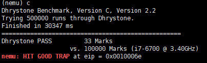

# 南京航空航天大学《计算机组成原理Ⅱ课程设计》报告

* 姓名：曹伟思
* 班级：1617302
* 学号：161730213
* 报告阶段：PA2.2, PA2.3
* 完成日期：2019.5.19
* 本次实验，我完成了所有内容。

## 目录

[TOC]

## PA2.2 思考题

### 什么是API？

应用程序接口(`Application Programming Interface`,又称为应用编程接口)是软件系统不同组成部分衔接的约定.
接口本身指一种规范或者说约定,用于说明供需的具体情况.

### AM属于硬件还是软件？

`AM`即不属于硬件也不属于软件,它只是一个抽象概念,描述了一个计算机应该具备的功能,或者说它描述的就是指令集体系本身.就像凶器没有具体所指,用于杀人的就是凶器.

### 堆和栈在哪里？

因为堆本身就是运行时分配的内存,而栈也是用来保存运行时环境变量和函数运行时栈帧的.程序运行时操作系统会在其进程空间通过对特定变量赋值来分配堆和栈.比如`Linux`中,堆为`start_brk`(堆起始,不变)和`brk`(堆结尾),栈为`rsp`(初始值即为栈底).`AM`带来了启示.

### 回忆运行过程

阅读当前目录`Makefile`之后大致了解`make ALL=xxx run`运行过程.

* 首先读取`$(AM_HOME)/Makefile.check`中的默认参数,包括之前设置的`ARCH`,由于已经修改文件中默认值,所以这里无需指定.
* 然后通过命令行指定的`ALL`寻找`tests`目录下对应的`*.c`文件.
* 根据`AM`中指定`ARCH`提供的编译链接规则编译生成可执行文件.
* 将可执行文件作为`nemu`的镜像启动`nemu`.控制权转交给`nemu`.

### 神奇的eflags（2）

```s
+-----+-----+------------------------------------+
| SF  |  OF |                 实例               |
+-----+-----+------------------------------------+
|  0  |  0  |               2 - 1                |
+-----+-----+------------------------------------+
|  0  |  1  |            (2 ^ 31) - 1            |
+-----+-----+------------------------------------+
|  1  |  0  |               1 - 2                |
+-----+-----+------------------------------------+
|  1  |  1  |         (2 ^ 31 - 1) - (-1)        |
+-----+-----+------------------------------------+
```

当`(OF || SF) == 0`,被减数大于减数.

### 这是巧合吗？

* `above`表示`op2 > op1`,无符号比较.
* `below`表示`op2 < op1`,无符号比较.
* `greater`表示`op2 > op1`,有符号比较.
* `less`表示`op2 < op1`,有符号比较.

### NEMU的本质

`IOE`,图像处理模块等.

## PA2.2 实验内容

### 任务1.1：实现更多的指令 && 任务 1.2：启用已实现指令 && 任务 1.3：逐个通过测试样例 && 任务 2：通过一键回归测试

在`all-instr.h`中声明新增函数.

```c
make_EHelper(add);
make_EHelper(cmp);
make_EHelper(inc);
make_EHelper(dec);
make_EHelper(neg);
make_EHelper(adc);
make_EHelper(sbb);
make_EHelper(mul);
make_EHelper(imul1);
make_EHelper(imul2);
make_EHelper(imul3);
make_EHelper(div);
make_EHelper(idiv);
make_EHelper(jmp);
make_EHelper(jcc);
make_EHelper(jmp_rm);
make_EHelper(call_rm);
make_EHelper(pusha);
make_EHelper(popa);
make_EHelper(leave);
make_EHelper(cltd);
make_EHelper(cwtl);
make_EHelper(movsx);
make_EHelper(movzx);
make_EHelper(lea);
make_EHelper(test);
make_EHelper(and);
make_EHelper(or);
make_EHelper(sar);
make_EHelper(shl);
make_EHelper(shr);
make_EHelper(setcc);
make_EHelper(not);
make_EHelper(nop);
make_EHelper(lidt);
make_EHelper(mov_r2cr);
make_EHelper(mov_cr2r);
make_EHelper(int);
make_EHelper(iret);
make_EHelper(in);
make_EHelper(out);
```

修改`exec.c`中的译码表.

```c
/* 0x80, 0x81, 0x83 */
make_group(gp1,
    EX(add), EX(or), EX(adc), EX(sbb),
    EX(and), EX(sub), EX(xor), EX(cmp))

  /* 0xc0, 0xc1, 0xd0, 0xd1, 0xd2, 0xd3 */
make_group(gp2,
    EX(rol), EMPTY, EMPTY, EMPTY,
    EX(shl), EX(shr), EMPTY, EX(sar))

  /* 0xf6, 0xf7 */
make_group(gp3,
    IDEX(test_I, test), EMPTY, EX(not), EX(neg),
    EX(mul), EX(imul1), EX(div), EX(idiv))

  /* 0xfe */
make_group(gp4,
    EX(inc), EX(dec), EMPTY, EMPTY,
    EMPTY, EMPTY, EMPTY, EMPTY)

  /* 0xff */
make_group(gp5,
    EX(inc), EX(dec), EX(call_rm), EX(call),
    EX(jmp_rm), EX(jmp), EX(push), EMPTY)

  /* 0x0f 0x01*/
make_group(gp7,
    EMPTY, EMPTY, EMPTY, EMPTY,
    EMPTY, EMPTY, EMPTY, EMPTY)

/* TODO: Add more instructions!!! */

opcode_entry opcode_table [512] = {
  /* 0x00 */    IDEXW(G2E, add, 1), IDEX(G2E, add), IDEXW(E2G, add, 1), IDEX(E2G, add),
  /* 0x04 */    IDEXW(I2a, add, 1), IDEX(I2a, add), EMPTY, EMPTY,
  /* 0x08 */    IDEXW(G2E, or, 1), IDEX(G2E, or), IDEXW(E2G, or, 1), IDEX(E2G, or),
  /* 0x0c */    IDEXW(I2a, or, 1), IDEX(I2a, or), EMPTY, EX(2byte_esc),
  /* 0x10 */    IDEXW(G2E, adc, 1), IDEX(G2E, adc), IDEXW(E2G, adc, 1), IDEX(E2G, adc),
  /* 0x14 */    IDEXW(I2a, adc, 1), IDEX(I2a, adc), EMPTY, EMPTY,
  /* 0x18 */    IDEXW(G2E, sbb, 1), IDEX(G2E, sbb), IDEXW(E2G, sbb, 1), IDEX(E2G, sbb),
  /* 0x1c */    IDEXW(I2a, sbb, 1), IDEX(I2a, sbb), EMPTY, EMPTY,
  /* 0x20 */    IDEXW(G2E, and, 1), IDEX(G2E, and), IDEXW(E2G, and, 1), IDEX(E2G, and),
  /* 0x24 */    IDEXW(I2a, and, 1), IDEX(I2a, and), EMPTY, EMPTY,
  /* 0x28 */    IDEXW(G2E, sub, 1), IDEX(G2E, sub), IDEXW(E2G, sub, 1), IDEX(E2G, sub),
  /* 0x2c */    IDEXW(I2a, sub, 1), IDEX(I2a, sub), EMPTY, EMPTY,
  /* 0x30 */    IDEXW(G2E, xor, 1), IDEX(G2E, xor), IDEXW(E2G, xor, 1), IDEX(E2G, xor),
  /* 0x34 */    IDEXW(I2a, xor, 1), IDEX(I2a, xor), EMPTY, EMPTY,
  /* 0x38 */    IDEXW(G2E, cmp, 1), IDEX(G2E, cmp), IDEXW(E2G, cmp, 1), IDEX(E2G, cmp),
  /* 0x3c */    IDEXW(I2a, cmp, 1), IDEX(I2a, cmp), EMPTY, EMPTY,
  /* 0x40 */    IDEX(r, inc), IDEX(r, inc), IDEX(r, inc), IDEX(r, inc),
  /* 0x44 */    IDEX(r, inc), IDEX(r, inc), IDEX(r, inc), IDEX(r, inc),
  /* 0x48 */    IDEX(r, dec), IDEX(r, dec), IDEX(r, dec), IDEX(r, dec),
  /* 0x4c */    IDEX(r, dec), IDEX(r, dec), IDEX(r, dec), IDEX(r, dec),
  /* 0x50 */    IDEX(r, push), IDEX(r, push), IDEX(r, push), IDEX(r, push),
  /* 0x54 */    IDEX(r, push), IDEX(r, push), IDEX(r, push), IDEX(r, push),
  /* 0x58 */    IDEX(r, pop), IDEX(r, pop), IDEX(r, pop), IDEX(r, pop),
  /* 0x5c */    IDEX(r, pop), IDEX(r, pop), IDEX(r, pop), IDEX(r, pop),
  /* 0x60 */    EX(pusha), EX(popa), EMPTY, EMPTY,
  /* 0x64 */    EMPTY, EMPTY, EX(operand_size), EMPTY,
  /* 0x68 */    IDEX(push_SI, push), IDEX(I_E2G, imul3), IDEXW(push_SI, push, 1), IDEX(I_E2G, imul3),
  /* 0x6c */    EMPTY, EMPTY, EMPTY, EMPTY,
  /* 0x70 */    IDEXW(J, jcc, 1), IDEXW(J, jcc, 1), IDEXW(J, jcc, 1), IDEXW(J, jcc, 1),
  /* 0x74 */    IDEXW(J, jcc, 1), IDEXW(J, jcc, 1), IDEXW(J, jcc, 1), IDEXW(J, jcc, 1),
  /* 0x78 */    IDEXW(J, jcc, 1), IDEXW(J, jcc, 1), IDEXW(J, jcc, 1), IDEXW(J, jcc, 1),
  /* 0x7c */    IDEXW(J, jcc, 1), IDEXW(J, jcc, 1), IDEXW(J, jcc, 1), IDEXW(J, jcc, 1),
  /* 0x80 */    IDEXW(I2E, gp1, 1), IDEX(I2E, gp1), EMPTY, IDEX(SI2E, gp1),
  /* 0x84 */    IDEXW(G2E, test, 1), IDEX(G2E, test), EMPTY, EMPTY,
  /* 0x88 */    IDEXW(mov_G2E, mov, 1), IDEX(mov_G2E, mov), IDEXW(mov_E2G, mov, 1), IDEX(mov_E2G, mov),
  /* 0x8c */    EMPTY, IDEX(lea_M2G, lea), EMPTY, IDEX(E, pop),
  /* 0x90 */    EX(nop), EMPTY, EMPTY, EMPTY,
  /* 0x94 */    EMPTY, EMPTY, EMPTY, EMPTY,
  /* 0x98 */    EX(cwtl), EX(cltd), EMPTY, EMPTY,
  /* 0x9c */    EMPTY, EMPTY, EMPTY, EMPTY,
  /* 0xa0 */    IDEXW(O2a, mov, 1), IDEX(O2a, mov), IDEXW(a2O, mov, 1), IDEX(a2O, mov),
  /* 0xa4 */    EMPTY, EMPTY, EMPTY, EMPTY,
  /* 0xa8 */    IDEXW(I2a, test, 1), IDEX(I2a, test), EMPTY, EMPTY,
  /* 0xac */    EMPTY, EMPTY, EMPTY, EMPTY,
  /* 0xb0 */    IDEXW(mov_I2r, mov, 1), IDEXW(mov_I2r, mov, 1), IDEXW(mov_I2r, mov, 1), IDEXW(mov_I2r, mov, 1),
  /* 0xb4 */    IDEXW(mov_I2r, mov, 1), IDEXW(mov_I2r, mov, 1), IDEXW(mov_I2r, mov, 1), IDEXW(mov_I2r, mov, 1),
  /* 0xb8 */    IDEX(mov_I2r, mov), IDEX(mov_I2r, mov), IDEX(mov_I2r, mov), IDEX(mov_I2r, mov),
  /* 0xbc */    IDEX(mov_I2r, mov), IDEX(mov_I2r, mov), IDEX(mov_I2r, mov), IDEX(mov_I2r, mov),
  /* 0xc0 */    IDEXW(gp2_Ib2E, gp2, 1), IDEX(gp2_Ib2E, gp2), IDEXW(I, ret, 2), EX(ret),
  /* 0xc4 */    EMPTY, EMPTY, IDEXW(mov_I2E, mov, 1), IDEX(mov_I2E, mov),
  /* 0xc8 */    EMPTY, EX(leave), EMPTY, EMPTY,
  /* 0xcc */    EX(int3), IDEXW(I, int, 1), EMPTY, EX(iret),
  /* 0xd0 */    IDEXW(gp2_1_E, gp2, 1), IDEX(gp2_1_E, gp2), IDEXW(gp2_cl2E, gp2, 1), IDEX(gp2_cl2E, gp2),
  /* 0xd4 */    EMPTY, EMPTY, EX(nemu_trap), EMPTY,
  /* 0xd8 */    EMPTY, EMPTY, EMPTY, EMPTY,
  /* 0xdc */    EMPTY, EMPTY, EMPTY, EMPTY,
  /* 0xe0 */    EMPTY, EMPTY, EMPTY, EMPTY,
  /* 0xe4 */    IDEXW(in_I2a, in, 1), IDEX(in_I2a, in), IDEXW(out_a2I, out, 1), IDEX(out_a2I, out),
  /* 0xe8 */    IDEX(J, call), IDEX(J, jmp), EMPTY, IDEXW(J, jmp, 1),
  /* 0xec */    IDEXW(in_dx2a, in, 1), IDEX(in_dx2a, in), IDEXW(out_a2dx, out, 1), IDEX(out_a2dx, out),
  /* 0xf0 */    EMPTY, EMPTY, EMPTY, EMPTY,
  /* 0xf4 */    EMPTY, EMPTY, IDEXW(E, gp3, 1), IDEX(E, gp3),
  /* 0xf8 */    EMPTY, EMPTY, EMPTY, EMPTY,
  /* 0xfc */    EMPTY, EMPTY, IDEXW(E, gp4, 1), IDEX(E, gp5),

  /*2 byte_opcode_table */

  ...
  /* 0x80 */    IDEX(J, jcc), IDEX(J, jcc), IDEX(J, jcc), IDEX(J, jcc),
  /* 0x84 */    IDEX(J, jcc), IDEX(J, jcc), IDEX(J, jcc), IDEX(J, jcc),
  /* 0x88 */    IDEX(J, jcc), IDEX(J, jcc), IDEX(J, jcc), IDEX(J, jcc),
  /* 0x8c */    IDEX(J, jcc), IDEX(J, jcc), IDEX(J, jcc), IDEX(J, jcc),
  /* 0x90 */    IDEXW(E, setcc, 1), IDEXW(E, setcc, 1), IDEXW(E, setcc, 1), IDEXW(E, setcc, 1),
  /* 0x94 */    IDEXW(E, setcc, 1), IDEXW(E, setcc, 1), IDEXW(E, setcc, 1), IDEXW(E, setcc, 1),
  /* 0x98 */    IDEXW(E, setcc, 1), IDEXW(E, setcc, 1), IDEXW(E, setcc, 1), IDEXW(E, setcc, 1),
  /* 0x9c */    IDEXW(E, setcc, 1), IDEXW(E, setcc, 1), IDEXW(E, setcc, 1), IDEXW(E, setcc, 1),
  /* 0xa0 */    EMPTY, EMPTY, EMPTY, EMPTY,
  /* 0xa4 */    EMPTY, EMPTY, EMPTY, EMPTY,
  /* 0xa8 */    EMPTY, EMPTY, EMPTY, EMPTY,
  /* 0xac */    EMPTY, EMPTY, EMPTY, IDEX(E2G, imul2),
  /* 0xb0 */    EMPTY, EMPTY, EMPTY, EMPTY,
  /* 0xb4 */    EMPTY, EMPTY, IDEXW(mov_E2G, movzx, 1), IDEXW(mov_E2G, movzx, 2),
  /* 0xb8 */    EMPTY, EMPTY, EMPTY, EMPTY,
  /* 0xbc */    EMPTY, EMPTY, IDEXW(mov_E2G, movsx, 1), IDEXW(mov_E2G, movsx, 2),
  ...
};
```

实现`arith.c`中未实现的函数.

```c
make_EHelper(add) {
  rtlreg_t result, flag;

  rtl_add(&result, &id_dest->val, &id_src->val);
  
  flag = 0;
  if (result < id_src->val || result < id_dest->val) {
    //CF
    flag = 1;
  }
  rtl_set_CF(&flag);
  
  flag = 0;
  if (((int)id_dest->val > 0 && (int)id_src->val > 0 && (int)result < 0)
  || ((int)id_dest->val < 0 && (int)id_src->val < 0 && (int)result > 0)) {
    //OF
    flag = 1;
  }
  rtl_set_OF(&flag);

  rtl_update_ZFSF(&result, id_dest->width);
  //更新ZFSF

  operand_write(id_dest, &result);
  //将结果写入目标Operand

  print_asm_template2(add);
}

make_EHelper(cmp) {
  //即没有写入的sub
  rtlreg_t result, flag;

  if (id_src->width == 1 && id_dest->width >= 2)
  {
    rtl_sext(&id_src->val, &id_src->val, id_src->width);
  }
  //sign-extended

  rtl_sub(&result, &id_dest->val, &id_src->val);

  flag = 0;
  if (((int)id_dest->val >= 0 && (int)id_src->val < 0 && (int)result < 0)
  || ((int)id_dest->val < 0 && (int)id_src->val >= 0 && (int)result > 0)) {
    //OF
    flag = 1;
  }
  rtl_set_OF(&flag);

  flag = 0;
  if (id_dest->val < id_src->val) {
    //CF
    flag = 1;
  }
  rtl_set_CF(&flag);

  rtl_update_ZFSF(&result, id_dest->width);
  //更新ZFSF

  print_asm_template2(cmp);
}

make_EHelper(inc) {
  rtlreg_t result, flag;

  result = id_dest->val + 1;

  flag = 0;
  if ((1 << (8 * id_dest->width - 1)) == result) {
    //OF
    flag = 1;
  }
  rtl_set_OF(&flag);

  flag = 0;
  if (0 == result) {
    //CF
    flag = 1;
  }
  rtl_set_CF(&flag);

  rtl_update_ZFSF(&result, id_dest->width);
  //更新ZFSF

  operand_write(id_dest, &result);
  //将结果写入目标Operand

  print_asm_template1(inc);
}

make_EHelper(dec) {
  rtlreg_t result, flag;

  result = id_dest->val - 1;

  flag = 0;
  if ((~0 >> (32 - 8 * id_dest->width - 1)) == result) {
    //OF
    flag = 1;
  }
  rtl_set_OF(&flag);

  flag = 0;
  if ((~0 >> (32 - 8 * id_dest->width)) == result) {
    //CF
    flag = 1;
  }
  rtl_set_CF(&flag);

  rtl_update_ZFSF(&result, id_dest->width);
  //更新ZFSF

  operand_write(id_dest, &result);
  //将结果写入目标Operand

  print_asm_template1(dec);
}

make_EHelper(neg) {
  rtlreg_t result, flag;

  result = -id_dest->val;

  flag = 0;
  if (id_dest->val != 0) {
    //CF
    flag = 1;
  }
  rtl_set_CF(&flag);

  flag = 0;
  if ((1 << (8 * id_dest->width - 1)) == id_dest->val) {
    //OF
    flag = 1;
  }
  rtl_set_OF(&flag);

  rtl_update_ZFSF(&result, id_dest->width);
  //更新ZFSF

  operand_write(id_dest, &result);
  //将结果写入目标Operand

  print_asm_template1(neg);
}
```

实现`cc.c`中未实现的函数.

```c
void rtl_setcc(rtlreg_t* dest, uint8_t subcode) {
  bool invert = subcode & 0x1;
  rtlreg_t a, b, c;
  enum {
    CC_O, CC_NO, CC_B,  CC_NB,
    CC_E, CC_NE, CC_BE, CC_NBE,
    CC_S, CC_NS, CC_P,  CC_NP,
    CC_L, CC_NL, CC_LE, CC_NLE
  };

  // TODO: Query EFLAGS to determine whether the condition code is satisfied.
  // dest <- ( cc is satisfied ? 1 : 0)
  switch (subcode & 0xe) {
    case CC_O:
      rtl_get_OF(dest);
      break;
    case CC_B:
      rtl_get_CF(dest);
      break;
    case CC_E:
      rtl_get_ZF(dest);
      break;
    case CC_BE:
      rtl_get_CF(&a);
      rtl_get_ZF(&b);
      *dest = a || b;
      break;
    case CC_S:
      rtl_get_SF(dest);
      break;
    case CC_L:
      rtl_get_SF(&a);
      rtl_get_OF(&b);
      rtl_get_ZF(&c);
      *dest = (a != b ) && !c;
      break;
    case CC_LE:
      rtl_get_SF(&a);
      rtl_get_OF(&b);
      rtl_get_ZF(&c);
      *dest = (a != b ) || c;
      break;
    default: panic("should not reach here");
    case CC_P: panic("n86 does not have PF");
  }

  if (invert) {
    rtl_xori(dest, dest, 0x1);
  }
}
```

实现`control.c`中未实现的函数.

```c
make_EHelper(call_rm) {
  rtl_push(&decoding.seq_eip);
  decoding.jmp_eip = id_dest->val;
  decoding.is_jmp = 1;

  print_asm("call *%s", id_dest->str);
}
```

实现`data-mov.c`中未实现的函数.

```c
make_EHelper(pusha) {
  if (decoding.is_operand_size_16) {
    t0 = reg_w(R_SP);
    //保存当前sp
    rtl_push((rtlreg_t *)&reg_w(R_AX));
    rtl_push((rtlreg_t *)&reg_w(R_CX));
    rtl_push((rtlreg_t *)&reg_w(R_DX));
    rtl_push((rtlreg_t *)&reg_w(R_BX));
    rtl_push(&t0);
    rtl_push((rtlreg_t *)&reg_w(R_BP));
    rtl_push((rtlreg_t *)&reg_w(R_SI));
    rtl_push((rtlreg_t *)&reg_w(R_DI));
  }
  else {
    t0 = reg_w(R_ESP);
    //保存当前esp
    rtl_push((rtlreg_t *)&reg_w(R_EAX));
    rtl_push((rtlreg_t *)&reg_w(R_ECX));
    rtl_push((rtlreg_t *)&reg_w(R_EDX));
    rtl_push((rtlreg_t *)&reg_w(R_EBX));
    rtl_push(&t0);
    rtl_push((rtlreg_t *)&reg_w(R_EBP));
    rtl_push((rtlreg_t *)&reg_w(R_ESI));
    rtl_push((rtlreg_t *)&reg_w(R_EDI));
  }

  print_asm("pusha");
}

make_EHelper(popa) {
  if (decoding.is_operand_size_16) {
    rtl_pop((rtlreg_t *)&reg_w(R_AX));
    rtl_pop((rtlreg_t *)&reg_w(R_CX));
    rtl_pop((rtlreg_t *)&reg_w(R_DX));
    rtl_pop((rtlreg_t *)&reg_w(R_BX));
    rtl_pop(&t0);
    //pading
    rtl_pop((rtlreg_t *)&reg_w(R_BP));
    rtl_pop((rtlreg_t *)&reg_w(R_SI));
    rtl_pop((rtlreg_t *)&reg_w(R_DI)); 
  }
  else {
    rtl_pop((rtlreg_t *)&reg_w(R_EAX));
    rtl_pop((rtlreg_t *)&reg_w(R_ECX));
    rtl_pop((rtlreg_t *)&reg_w(R_EDX));
    rtl_pop((rtlreg_t *)&reg_w(R_EBX));
    rtl_pop(&t0);
    //pading
    rtl_pop((rtlreg_t *)&reg_w(R_EBP));
    rtl_pop((rtlreg_t *)&reg_w(R_ESI));
    rtl_pop((rtlreg_t *)&reg_w(R_EDI));
  }

  print_asm("popa");
}

make_EHelper(leave) {
  if (decoding.is_operand_size_16) {
    reg_w(R_SP) = reg_w(R_BP);
    rtl_pop((rtlreg_t *)&reg_w(R_BP));
  }
  else {
    reg_l(R_ESP) = reg_l(R_EBP);
    rtl_pop((rtlreg_t *)&reg_l(R_EBP));
  }

  print_asm("leave");
}

make_EHelper(cltd) {
  if (decoding.is_operand_size_16) {
    if (reg_w(R_AX) < 0) {
      reg_w(R_DX) = 0xffff;
    }
    else {
      reg_w(R_DX) = 0;
    }
  }
  else {
    if (reg_l(R_EAX) < 0) {
      reg_l(R_EDX) = 0xffffffff;
    }
    else {
      reg_l(R_EDX) = 0;
    }
  }

  print_asm(decoding.is_operand_size_16 ? "cwtl" : "cltd");
}

make_EHelper(cwtl) {
  if (decoding.is_operand_size_16) {
    rtl_sext((rtlreg_t *)&reg_w(R_AX), (rtlreg_t *)&reg_b(R_AL), 2);
  }
  else {
    rtl_sext((rtlreg_t *)&reg_l(R_EAX), (rtlreg_t *)&reg_w(R_AX), 4);
  }

  print_asm(decoding.is_operand_size_16 ? "cbtw" : "cwtl");
}
```

实现`logic.c`中未实现的函数.

```c
make_EHelper(test) {
  rtlreg_t result, flag;

  rtl_and(&result, &id_dest->val, &id_src->val);

  flag = 0;
  rtl_set_CF(&flag);
  rtl_set_OF(&flag);
  //直接置0
  
  rtl_update_ZFSF(&result, id_dest->width);
  //更新ZFSF

  print_asm_template2(test);
}

make_EHelper(and) {
  rtlreg_t result, flag;

  rtl_and(&result, &id_dest->val, &id_src->val);

  flag = 0;
  rtl_set_CF(&flag);
  rtl_set_OF(&flag);
  //直接置0
  
  rtl_update_ZFSF(&result, id_dest->width);
  //更新ZFSF

  operand_write(id_dest, &result);
  //将结果写入目标Operand

  print_asm_template2(and);
}

make_EHelper(or) {
  rtlreg_t result, flag;

  rtl_or(&result, &id_dest->val, &id_src->val);

  flag = 0;
  rtl_set_CF(&flag);
  rtl_set_OF(&flag);
  //直接置0

  rtl_update_ZFSF(&flag, id_dest->width);
  //更新ZFSF

  operand_write(id_dest, &result);
  //将结果写入目标Operand

  print_asm_template2(or);
}

make_EHelper(sar) {
  rtlreg_t result;

  rtl_sar(&result, &id_dest->val, &id_src->val);

  rtl_update_ZFSF(&flag, id_dest->width);
  //更新ZFSF

  operand_write(id_dest, &result);
  //将结果写入目标Operand

  print_asm_template2(sar);
}

make_EHelper(shl) {
  rtlreg_t result;

  rtl_sal(&result, &id_dest->val, &id_src->val);

  rtl_update_ZFSF(&flag, id_dest->width);
  //更新ZFSF

  operand_write(id_dest, &result);
  //将结果写入目标Operand

  print_asm_template2(shl);
}

make_EHelper(shr) {
  rtlreg_t result;

  rtl_shr(&result, &id_dest->val, &id_src->val);

  rtl_update_ZFSF(&flag, id_dest->width);
  //更新ZFSF

  operand_write(id_dest, &result);
  //将结果写入目标Operand

  print_asm_template2(shr);
}

make_EHelper(not) {
  rtlreg_t result;

  result = id_dest->val;
  rtl_not(&result);

  operand_write(id_dest, &result);
  //将结果写入目标Operand

  print_asm_template1(not);
}

make_EHelper(rol) {
  int i;

  for (i = 0; i < id_src->val; i++) {
    t0 = id_src->val & (0x8000 << ((id_src->width - 2) * 8));
    t0 = t0 >> (id_src->width * 8 - 1);
    t1 = id_dest->val << 1;
    t1 &= t0;
  }

  operand_write(id_dest, &t1);
  //将结果写入目标Operand

  print_asm_template2(rol);
}
```

修改之前的`bug`.

`decode.c`.

```c
static inline make_DopHelper(SI) {
  assert(op->width == 1 || op->width == 4);

  op->type = OP_TYPE_IMM;
  t0 = instr_fetch(eip, op->width);
  rtl_sext((rtlreg_t *)&op->simm, &t0, op->width);
  rtl_li(&op->val, op->simm);

#ifdef DEBUG
  snprintf(op->str, OP_STR_SIZE, "$0x%x", op->simm);
#endif
}
```

`rtl.h`.

```c
static inline void rtl_sext(rtlreg_t* dest, const rtlreg_t* src1, int width) {
  unsigned flag = *src1  & 0x1 << (width * 8 - 1);
  //判断符号位
  *dest = flag ? (width != 4 ? (~0 << (8 * width) | *src1) : *src1) : *src1;
}

static inline void rtl_update_ZF(const rtlreg_t* result, int width) {
  cpu.eflags.ZF = (*result << ((4 - width) * 8)) ? 0 : 1;
}
```

通过一键回归测试.


## PA2.3 思考题

### 设备是如何工作的？

对与设备通信得分端口编号,然后通过特定指令向相应编号的端口发送数据从而与设备交互.

### CPU需要知道设备是如何工作的吗？

不需要,这也是计算机系统中又一个接口的实例.

### 什么是驱动？

驱动是一个允许应用程序与硬件交互的程序,这种程序创建了一个硬件与硬件,或硬件与软件沟通的接口,经由主板上的总线或其它沟通子系统与硬件形成连接的机制,这样的机制使得硬件设备上的数据交换成为可能.

### CPU知道吗？

不需要知道.

### 再次理解volatile关键字

如果`0x8048000`被映射到一个设备寄存器将检测不到设备寄存器的变化从而进入死循环.

### Hello World运行在哪？

不一样,前者运行在真机上,后者运行在`nemu`上.

### 如何检测多个按键同时被按下？

相当于维护一个队列,每个按键有对应按下和松开的码数,按下加入队列,松开离开队列.

### 必答题

#### 编译与链接Ⅰ

去掉`static`:无报错,但是产生可执行文件变大.
去掉`inline`:报错,在`special.c`中定义了但未使用相应`rtl`函数.这是因为`special.c`中`include`了`rtl.h`文件,所以预处理会将函数定义复制到源文件中,又因为没有使用所以报错.
去掉两者:报错,在所有目标文件中重复定义了相应`rtl`函数,同理是因为预处理.

#### 编译与链接Ⅱ

* `29`.


* `29`.每个包含`common.h`和`debug.h`头文件的源文件都会有一个`dummy`变量实体.
* 报错原因是重复定义变量.此前没报错是因为只声明未初始化为弱符号,初始化了的为强符号,多个强符号会发生重复定义错误.

#### I/O端口与接口

系统`I/O`地址的范围是`0x0 ~ 0x399`.端口的地址范围是`0 ~ 0xffff`.`1k = 0x400`.

最常见的就是与显示器的通讯,`CPU`向显示器传输了数据和地址,而显示器向`CPU`返回状态信息.

## PA2.3 实验内容

### 任务 1：加入IOE

修改`nemu/include/common.h`.

```c
/* You will define this macro in PA2 */
#define HAS_IOE
```


### 任务2：实现输入输出指令，运行Hello World

修改并声明`nemu/src/cpu/exec/system.c`中的`in`,`out`.

```c
make_EHelper(in) {
  t0 = pio_read(id_src->val, id_src->width);
  operand_write(id_dest, &t0);

  print_asm_template2(in);

#ifdef DIFF_TEST
  diff_test_skip_qemu();
#endif
}

make_EHelper(out) {
  pio_write(id_dest->val, id_dest->width, id_src->val);

  print_asm_template2(out);

#ifdef DIFF_TEST
  diff_test_skip_qemu();
#endif
}
```

定义宏`HAS_SERIAL`后运行`hello`.


### 任务2.1：实现IOE抽象 && 任务3：运行timetest

实现`_uptime()`.

```c
unsigned long _uptime() {
  return inl(RTC_PORT) - boot_time;
}
```


### 任务4：看看NEMU跑多快

`dhrystone`.



`coremark`.


`microbench`.


### 任务2.2：实现IOE抽象 && 任务5：运行keytest

实现`_read_key()`.

```c
#define I8042_DATA_PORT 0x60

#define I8042_STATUS_PORT 0x64

int _read_key() {
  if (inb(I8042_STATUS_PORT) == 1) {
    return inl(I8042_DATA_PORT);
  }
  return _KEY_NONE;
}
```

`keytest`.


### 任务2.3：实现IOE抽象 && 任务6：添加内存映射I/O && 任务7：运行 videotest

修改`nemu/src/memory/memory.c`的`paddr_read()`和`paddr_write()`函数.

```c
#include "device/mmio.h"

uint32_t paddr_read(paddr_t addr, int len) {
  int mmio_id = is_mmio(addr);
    if (mmio_id != -1) {
    return mmio_read(addr, len, mmio_id);
  }
  return pmem_rw(addr, uint32_t) & (~0u >> ((4 - len) << 3));
}

void paddr_write(paddr_t addr, int len, uint32_t data) {
  int mmio_id = is_mmio(addr);
  if (mmio_id != -1) {
    mmio_write(addr, len, data, mmio_id);
  }
  else {
    memcpy(guest_to_host(addr), &data, len);
  }
}
```

`videotest`.


### 终极任务：运行打字小游戏


## 遇到的问题及解决办法

查阅`i386`手册十分繁琐,忽略了`width == 4`时移位操作产生的问题等.

## 实验心得

机器永远是对的.

## 其他备注

由于去天津参加比赛,大电脑不好操作使用了另外一台电脑(只有`Linux`)写代码,后复制到大电脑上调式提交.