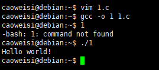
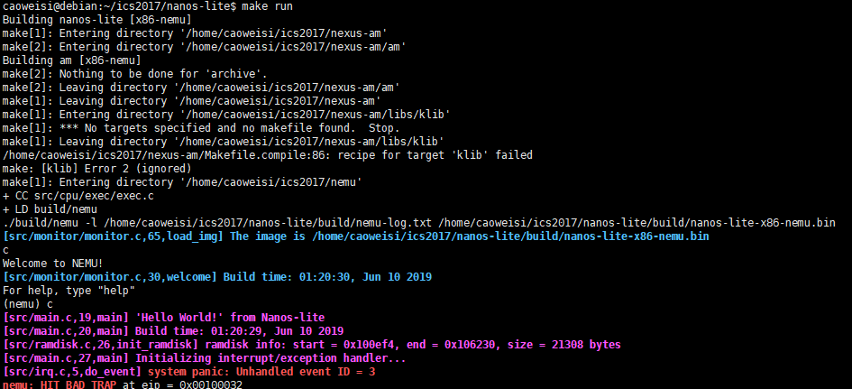
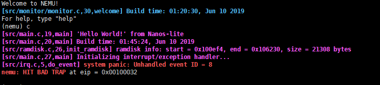
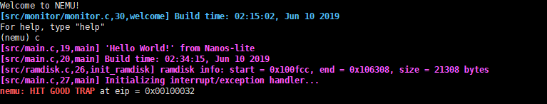
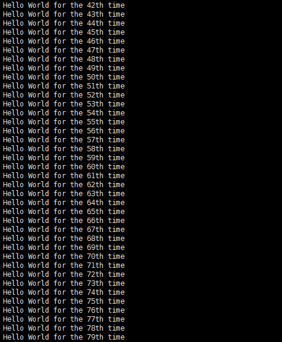
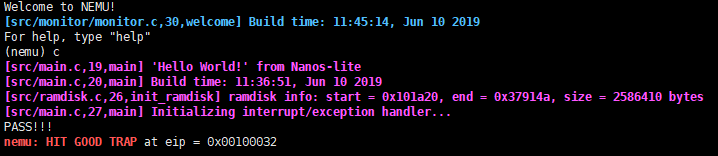
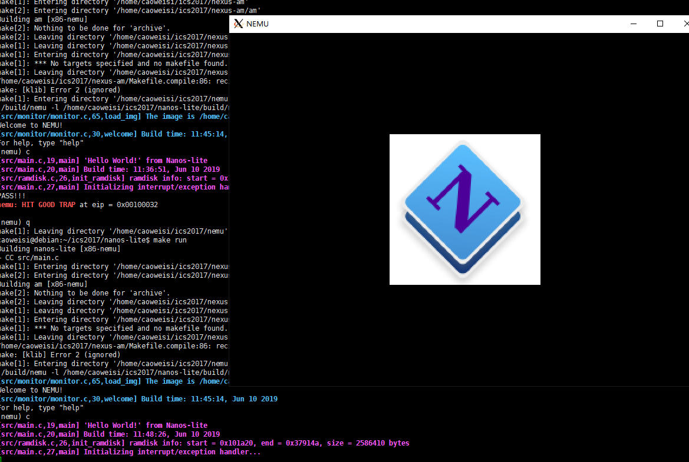
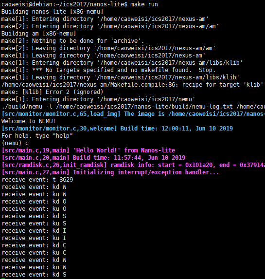
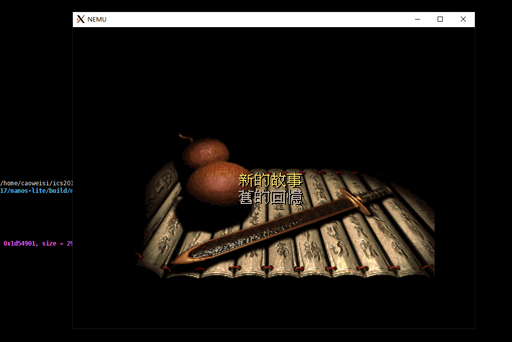

# 南京航空航天大学《计算机组成原理Ⅱ课程设计》报告

* 姓名：曹伟思
* 班级：1617302
* 学号：161730213
* 报告阶段：PA3.1
* 完成日期：2019.6.9
* 本次实验，我完成了所有内容。

## 目录

[TOC]

## 思考题

### 什么是操作系统？

操作系统,顾名思义就是用于操作的一个系统,其操作的对象是电子设备,比如读写硬盘上的数据,将程序加载进内存(创建进程)等等.操作系统抽象这些操作,以一种人们方便,简洁的操作接口展示出来,其更笨目的是为了帮助人们更简单操作电子设备.

### 我们不一样，吗？

没有什么差距,可以,两者之间知识功能不同.

### 操作系统的实质

操作系统就是一个较为大型的程序,它和直接运行在硬件上的程序无实质差别.

### 程序真的结束了吗？

回答正确,实际上是返回到了`__libc_start_main`函数(`linux`).

### 触发系统调用

编译运行代码即可.



### 有什么不同？

函数调用,调用者保护寄存器,可以,与用户编写的函数的不同点在于保存的内容和特权级不同.

### 段错误

段错误发生原因为程序访问了没有权限访问的虚拟内存页,而程序会访问哪些地方编译阶段是不可知的,段错误通常是由程序数据越界,使用了野指针,或者是使用了不安全的函数(`gets`)导致的.

### 对比异常与函数调用

因为这两种情况下会破坏的环境和恢复状态需要的环境不一样.

### 诡异的代码

因为构造`trap frame`改变了`esp`.

### 注意区分事件号和系统调用号

事件号是异常中断的号码,系统调用号是当事件号为`80`触发系统调用时`eax`寄存器的值.

### 打印不出来？

`fflush(stdout)`刷新缓冲区即可.


### 理解文件管理函数

`fs_open()`:用文件名参数到文件描述符表中匹配并返回下标,没找到则报错.
`fs_read()`:通过`fd`参数获取文件偏移和长度,再从`ramdisk`或`dispinfo`中读取数据到`buf`中.
`fs_write()`:通过`fd`选择写方式.若是文件写,则计算偏移和读取长度进行文件读写.
`fs_lseek()`:通过`whence`选择移动文件偏移的方式,然后将新的偏移赋给对应文件描述符.
`fs_close()`:直接返回`0`,因为不需要`close`.

### 不再神秘的秘技

因为写程序就是写`bug`.

### 必答题

编译后的程序被保存在`ramdisk`文件中,`make run`先运行`nemu`,然后在`nemu`上运行`Nanos-lite`.`Nanos-lite`的`main`函数中使用`loader`加载位于`ramdisk`存储区(实际存在与内存中)的`/bin/pal`程序.`loader`函数从`ramdisk`文件(磁盘)中读取程序到内存区,进行一些初始化操作后,便将控制转到仙剑的`main`入口函数.仙剑程序调用库函数和`Nanos-lite`中自定义的库函数完成程序的运行.包括文件的读写和`UI`的显示等等.

## 实验内容

### 任务1：实现简单 loader

修改`nanos-lite/src/loader.c`实现`loader`.

```c
void ramdisk_read(void *buf, off_t offset, size_t len);
void ramdisk_write(const void *buf, off_t offset, size_t len);
size_t get_ramdisk_size();

uintptr_t loader(_Protect *as, const char *filename) {
  ramdisk_read(DEFAULT_ENTRY, 0, get_ramdisk_size());
  return (uintptr_t)DEFAULT_ENTRY;
}
```

### 任务2.1：中断机制前的准备工作 && 任务2.2：实现中断机制

修改`nemu/include/cpu/reg.h`中的`CPU_state`联合.

```c
typedef union {
  union {
    uint32_t _32;
    uint16_t _16;
    uint8_t _8[2];
  } gpr[8];

  struct {
    rtlreg_t eax;
    rtlreg_t ecx;
    rtlreg_t edx;
    rtlreg_t ebx;
    rtlreg_t esp;
    rtlreg_t ebp;
    rtlreg_t esi;
    rtlreg_t edi;
    vaddr_t eip;
    union {
      struct {
        uint32_t CF :1;
        uint32_t one:1;
        uint32_t :4;
        uint32_t ZF :1;
        uint32_t SF :1;
        uint32_t :1;
        uint32_t IF :1;
        uint32_t :1;
        uint32_t OF :1;
        uint32_t :20;
      } eflags;
      uint32_t eflags_num;
    };
    struct{
      uint16_t limit;
      uint32_t base;
    } idtr;
    uint16_t cs;
  };
} CPU_state;
```

修改`nemu/src/cpu/exec/system.c`实现`lidt`,`int`指令.

查表可知.

```txt
IF instruction = LIDT
THEN
  IF OperandSize = 16
  THEN
    IDTR.Limit:Base ← m16:24 (* 24 bits of base loaded *)
  ELSE
    IDTR.Limit:Base ← m16:32
  FI;
ELSE (* instruction = LGDT *)
  ...
FI;
```

```c
void raise_intr(uint8_t NO, vaddr_t ret_addr);

make_EHelper(lidt) {
  cpu.idtr.limit = vaddr_read(id_dest->addr, 2);
  if (decoding.is_operand_size_16)
    cpu.idtr.base = vaddr_read(id_dest->addr + 2, 3);
  else
    cpu.idtr.base = vaddr_read(id_dest->addr + 2, 4);

  print_asm_template1(lidt);
}

...

make_EHelper(int) {
  raise_intr(id_dest->val, decoding.seq_eip);

  print_asm("int %s", id_dest->str);

#ifdef DIFF_TEST
  diff_test_skip_nemu();
#endif
}
```

修改`nemu/src/cpu/intr.c`实现`raise_intr()`.

```c
void raise_intr(uint8_t NO, vaddr_t ret_addr) {
  /* TODO: Trigger an interrupt/exception with ``NO''.
   * That is, use ``NO'' to index the IDT.
   */

  vaddr_t idt_addr;
  GateDesc gateDesc;

  rtl_push((rtlreg_t*)&cpu.eflags);
  rtl_push((rtlreg_t*)&cpu.cs);
  rtl_push((rtlreg_t*)&ret_addr);
  
  idt_addr = cpu.idtr.base + NO * 8;
  *(uint32_t *)&gateDesc = vaddr_read(idt_addr, 4);
  *((uint32_t *)&gateDesc + 1) = vaddr_read(idt_addr + 4, 4);

  decoding.is_jmp = 1;
  decoding.jmp_eip = (gateDesc.offset_31_16 << 16) | (gateDesc.offset_15_0 & 0xffff);
}
```

修改`nemu/src/monitor/monitor.c`的`restart()`.

```c
static inline void restart() {
  /* Set the initial instruction pointer. */
  cpu.eip = ENTRY_START;
  cpu.eflags_num = 0x2;
  aou.cs = 8;

#ifdef DIFF_TEST
  init_qemu_reg();
#endif
}
```

运行成功.



### 任务3：重新组织TrapFrame结构体

修改`nemu/src/cpu/exec/data-mov.c`实现`pusha`.

```c
make_EHelper(pusha) {
  if (decoding.is_operand_size_16) {
    t0 = reg_w(R_SP);
    //保存当前sp
    rtl_push((rtlreg_t *)&reg_w(R_AX));
    rtl_push((rtlreg_t *)&reg_w(R_CX));
    rtl_push((rtlreg_t *)&reg_w(R_DX));
    rtl_push((rtlreg_t *)&reg_w(R_BX));
    rtl_push(&t0);
    rtl_push((rtlreg_t *)&reg_w(R_BP));
    rtl_push((rtlreg_t *)&reg_w(R_SI));
    rtl_push((rtlreg_t *)&reg_w(R_DI));
  }
  else {
    t0 = reg_w(R_ESP);
    //保存当前esp
    rtl_push((rtlreg_t *)&reg_w(R_EAX));
    rtl_push((rtlreg_t *)&reg_w(R_ECX));
    rtl_push((rtlreg_t *)&reg_w(R_EDX));
    rtl_push((rtlreg_t *)&reg_w(R_EBX));
    rtl_push(&t0);
    rtl_push((rtlreg_t *)&reg_w(R_EBP));
    rtl_push((rtlreg_t *)&reg_w(R_ESI));
    rtl_push((rtlreg_t *)&reg_w(R_EDI));
  }

  print_asm("pusha");
}
```

修改`nexus-am/am/arch/x86-nemu/include/arch.h`重定义`_RegSet`结构体.

```c
struct _RegSet {
  uintptr_t edi, esi, ebp, esp, ebx, edx, ecx, eax;
  int irq;
  uintptr_t error, eip, cs, eflags;
};
```

运行成功.



### 任务4：实现系统调用

修改`nanos-lite/src/irp.c`中的`do_event`.

```c
static _RegSet* do_event(_Event e, _RegSet* r) {
  switch (e.event) {
    case _EVENT_SYSCALL:
      return do_syscall(r);
    default: panic("Unhandled event ID = %d", e.event);
  }

  return NULL;
}
```

修改`nexus-am/am/arch/x86-nemu/include/arch.h`实现`SYSCALL_ARGx()`宏.

```c
#define SYSCALL_ARG1(r) (r->eax)
#define SYSCALL_ARG2(r) (r->ebx)
#define SYSCALL_ARG3(r) (r->ecx)
#define SYSCALL_ARG4(r) (r->edx)
```

修改`nanos-lite/src/syscall.c`的`do_syscall`实现`SYS_none`和`SYS_exit`系统调用.

```c
_RegSet* do_syscall(_RegSet *r) {
  uintptr_t a[4];
  a[0] = SYSCALL_ARG1(r);

  switch (a[0]) {
    case SYS_none:
      SYSCALL_ARG1(r) = 1;
      break;
    case SYS_exit:
      _halt(SYSCALL_ARG2(r));
      break;
    default: panic("Unhandled syscall ID = %d", a[0]);
  }

  return NULL;
}
```

修改`nemu/src/cpu/exec/data-mov.c`实现`popa`.

```c
make_EHelper(popa) {
  if (decoding.is_operand_size_16) {
    rtl_pop((rtlreg_t*)&reg_w(R_DI));
    rtl_pop((rtlreg_t*)&reg_w(R_SI));
    rtl_pop((rtlreg_t*)&reg_w(R_BP));
    rtl_pop(&t0);
    //pading
    rtl_pop((rtlreg_t*)&reg_w(R_BX));
    rtl_pop((rtlreg_t*)&reg_w(R_DX));
    rtl_pop((rtlreg_t*)&reg_w(R_CX));
    rtl_pop((rtlreg_t*)&reg_w(R_AX));
  }
  else {
    rtl_pop((rtlreg_t*)&reg_w(R_EDI));
    rtl_pop((rtlreg_t*)&reg_w(R_ESI));
    rtl_pop((rtlreg_t*)&reg_w(R_EBP));
    rtl_pop(&t0); 
    //pading
    rtl_pop((rtlreg_t*)&reg_w(R_EBX));
    rtl_pop((rtlreg_t*)&reg_w(R_EDX));
    rtl_pop((rtlreg_t*)&reg_w(R_ECX));
    rtl_pop((rtlreg_t*)&reg_w(R_EAX));
  }

  print_asm("popa");
}
```

修改`nemu/src/cpu/exec/system.c`实现`iret`.

```c
make_EHelper(iret) {
  rtl_pop(&t0);
  decoding.jmp_eip = t0;
  rtl_pop(&t0);
  cpu.cs = (uint16_t)t0;
  rtl_pop(&t0);
  cpu.eflags_num = t0;
  //恢复eip, cs, eflags.

  decoding.is_jmp = 1;

  print_asm("iret");
}
```

运行成功.



### 任务5：在Nanos-lite上运行Hello world

修改`nanos-lite/src/syscall.c`的`do_syscall`实现`SYS_write`系统调用.

```c
static inline uintptr_t sys_write(uintptr_t fd, uintptr_t buf, uintptr_t len) {
  if (fd == 1 || fd == 2) {
    int i;
    for (i = 0; i < len; i++, buf++) {
      _putc(*(char*)buf);
    }
  }
  
  return 1;
}

_RegSet* do_syscall(_RegSet *r) {
  uintptr_t a[4];
  a[0] = SYSCALL_ARG1(r);

  switch (a[0]) {
    case SYS_none:
      SYSCALL_ARG1(r) = 1;
      break;
    case SYS_exit:
      _halt(SYSCALL_ARG2(r));
      break;
    case SYS_write:
      SYSCALL_ARG1(r) = sys_write(SYSCALL_ARG2(r), SYSCALL_ARG3(r), SYSCALL_ARG4(r));
      break;
    default: panic("Unhandled syscall ID = %d", a[0]);
  }

  return NULL;
}
```

修改`navy-apps/libs/libos/src/nanos.c`实现`_write()`.

```c
int _write(int fd, void *buf, size_t count){
  _syscall_(SYS_write, fd, (uintptr_t)buf, count);
}
```

运行成功.



### 任务6：实现堆区管理

修改`nanos-lite/src/syscall.c`的`do_syscall`实现`SYS_brk`系统调用.

```c
static inline uintptr_t sys_brk(uintptr_t new_brk) {
  return (uintptr_t)mm_brk(new_brk);
}

_RegSet* do_syscall(_RegSet *r) {
  uintptr_t a[4];
  a[0] = SYSCALL_ARG1(r);

  switch (a[0]) {
    case SYS_none:
      SYSCALL_ARG1(r) = 1;
      break;
    case SYS_exit:
      _halt(SYSCALL_ARG2(r));
      break;
    case SYS_write:
      SYSCALL_ARG1(r) = sys_write(SYSCALL_ARG2(r), SYSCALL_ARG3(r), SYSCALL_ARG4(r));
      break;
    case SYS_brk:
      SYSCALL_ARG1(r) = sys_brk(SYSCALL_ARG2(r));
      break;
    default: panic("Unhandled syscall ID = %d", a[0]);
  }

  return NULL;
}
```

修改`navy-apps/libs/libos/src/nanos.c`实现`_sbrk()`.

```c
extern char _end;
//引用ld默认添加的符号
intptr_t program_break = (intptr_t)&_end;

...

void *_sbrk(intptr_t increment){
  intptr_t old_program_break = program_break;

  if (_syscall_(SYS_brk, program_break + increment, 0, 0) == 0) {
    program_break = program_break + increment;
    return (void *)old_program_break;
  }
  else {
    return -1;
  }
}
```

### 任务7：让loader使用文件

修改`nanos-lite/src/loader.c`实现`loader`.

```c
uintptr_t loader(_Protect *as, const char *filename) {
  int fd = fs_open(filename, 0, 0);
  size_t f_size = fs_filesz(fd);
  fs_read(fd, DEFAULT_ENTRY, f_size);
  fs_close(fd);
  
  return (uintptr_t)DEFAULT_ENTRY;
}
```

### 任务：实现完整的文件系统 && 任务8：实现系统调用

修改`nanos-lite/src/syscall.c`的`do_syscall`实现相应系统调用.

```c
static inline uintptr_t sys_open(uintptr_t pathname, uintptr_t flags, uintptr_t mode) {
  return fs_open((char *)pathname, flags, mode);
}

static inline uintptr_t sys_read(uintptr_t fd, uintptr_t buf, uintptr_t len) {
  return fs_read(fd, (void*)buf, len);
}

static inline uintptr_t sys_lseek(uintptr_t fd, uintptr_t offset, uintptr_t whence) {
  return fs_lseek(fd, offset, whence);
}

static inline uintptr_t sys_close(uintptr_t fd) {
  return fs_close(fd);
}

static inline uintptr_t sys_brk(uintptr_t new_brk) {
  return (uintptr_t)mm_brk(new_brk);
}

static inline uintptr_t sys_write(uintptr_t fd, uintptr_t buf, uintptr_t len) {
  return fs_write(fd, (void*)buf, len);
}

_RegSet* do_syscall(_RegSet *r) {
  uintptr_t a[4];
  a[0] = SYSCALL_ARG1(r);

  switch (a[0]) {
    case SYS_none:
      SYSCALL_ARG1(r) = 1;
      break;
    case SYS_exit:
      _halt(SYSCALL_ARG2(r));
      break;
    case SYS_write:
      SYSCALL_ARG1(r) = sys_write(SYSCALL_ARG2(r), SYSCALL_ARG3(r), SYSCALL_ARG4(r));
      break;
    case SYS_open:
      SYSCALL_ARG1(r) = sys_open(SYSCALL_ARG2(r), SYSCALL_ARG3(r), SYSCALL_ARG4(r));
      break;
    case SYS_read:
      SYSCALL_ARG1(r) = sys_read(SYSCALL_ARG2(r), SYSCALL_ARG3(r), SYSCALL_ARG4(r));
      break;
    case SYS_lseek:
      SYSCALL_ARG1(r) = sys_lseek(SYSCALL_ARG2(r), SYSCALL_ARG3(r), SYSCALL_ARG4(r));
      break;
    case SYS_close:
      SYSCALL_ARG1(r) = sys_close(SYSCALL_ARG2(r));
      break;
    case SYS_brk:
      SYSCALL_ARG1(r) = sys_brk(SYSCALL_ARG2(r));
      break;
    default: panic("Unhandled syscall ID = %d", a[0]);
  }

  return NULL;
}
```

修改`navy-apps/libs/libos/src/nanos.c`中的相应接口函数.

```c
int _open(const char *path, int flags, mode_t mode) {
  return _syscall_(SYS_open, (uintptr_t)path, flags, mode);
}

int _write(int fd, void *buf, size_t count){
  return _syscall_(SYS_write, fd, (uintptr_t)buf, count);
}

int _read(int fd, void *buf, size_t count) {
  return _syscall_(SYS_read, fd, (uintptr_t)buf, count);
}

int _close(int fd) {
  return _syscall_(SYS_close, fd, 0, 0);
}

off_t _lseek(int fd, off_t offset, int whence) {
  return _syscall_(SYS_lseek, fd, offset, whence);
}
```

修改`nanos-lite\src\main.c`中`loader`函数的参数.

```c
uint32_t entry = loader(NULL, "/bin/text");
```

运行成功.



### 任务9：把VGA显存抽象成文件

修改`nanos-lite\src\main.c`中`loader`函数的参数.

```c
uint32_t entry = loader(NULL, "/bin/bmptest");
```

运行成功.



### 任务10：把设备输入抽象成文件

修改`nanos-lite\src\main.c`中`loader`函数的参数.

```c
uint32_t entry = loader(NULL, "/bin/events");
```

运行成功.



### 任务11：在NEMU中运行仙剑奇侠传

修改`nanos-lite\src\main.c`中`loader`函数的参数.

```c
uint32_t entry = loader(NULL, "/bin/pal");
```

运行成功.



## 遇到的问题及解决办法

拉取框架代码时发现对之前修改的代码产生了覆盖,很奇怪为什么没有问`merge`,一开始没发现一直卡在这里.

## 实验心得

无.

## 其他备注

无.
