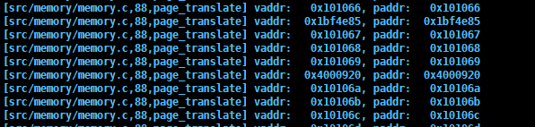
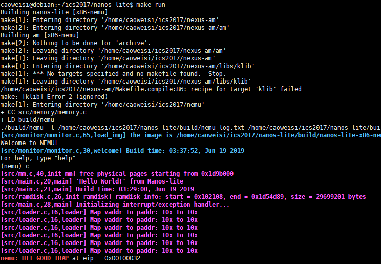
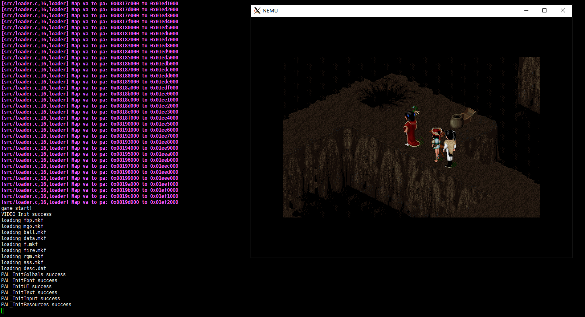

# 南京航空航天大学《计算机组成原理Ⅱ课程设计》报告

* 姓名：曹伟思
* 班级：1617302
* 学号：161730213
* 报告阶段：PA3.2
* 完成日期：2019.6.19
* 本次实验，我完成了所有内容。

## 目录

[TOC]

## 思考题

### 一些问题

1. 因为一个页有`4k = 2 ^ 12`,所以基地址信息只需要`32 - 12 = 20`位即可.
2. 必须,不能,因为表项的作用本来就是将虚拟地址转换成物理地址.
3. 一级页表需要保存所有进程的页信息,耗费的内存空间过多,同时也不利于上下文切换的操作.

### 空指针真的是'空'的吗?

不是,当程序对空指针解引用的时候,计算机就会弹出异常并终止程序,实际上`NULL`的本质就是整数`0`

### 理解_map()函数

```c
void _map(_Protect *p, void *va, void *pa) {
  PDE * pt = (PDE *)p->ptr;
  //获取页目录表的基地址.
  PDE * pde = &pt[PDX(va)];
  //获取页目录项的地址.
  if (!(*pde & PTE_P)) {
    *pde = PTE_P | PTE_W | PTE_U | (uint32_t)palloc_f();
  }
  //若该页目录项的present位为0,就通过palloc_f()重新申请一个页并返回页表基地址.
  PTE *pte = &((PTE *)PTE_ADDR(*pde))[PTX(va)];
  //获取页表项
  if (!(*pte & PTE_P)) {
    *pte = PTE_P | PTE_W | PTE_U | (uint32_t)pa;
  }
  //若该页表项的present位为0,就将新页的物理地址与几个字段结合,赋给页表项.
}
```

该函数将虚拟地址空间`p`中的虚拟地址`va`映射到物理地址`pa`.

### 内核映射的作用

将内核的页映射加到该进程的页表中从而避免当该进程通过内核的虚拟地址访问内核时得不到物理地址.

## 实验内容

### 任务 1：在NEMU中实现分页机制

修改`nanos-lite/src/main.c`,定义宏`HAS_PTE`.

修改`nemu/include/cpu/reg.h`添加`CR3`寄存器和`CR0`寄存器.

```c
typedef union {
  union {
    ...
  } gpr[8];

  struct {
    ...
    CR0 cr0;
    CR3 cr3;
  };
} CPU_state;
```

修改`nemu/src/cpu/exec/exec.c`增加对应指令表项(服从`KISS`原则).

```c
/*2 byte_opcode_table */
...
/* 0x20 */  IDEX(mov_G2E, mov_cr2r), EMPTY, IDEX(mov_E2G, mov_r2cr), EMPTY,
...
```

修改`nemu/src/cpu/exec/system.c`实现对应函数.

```c
make_EHelper(mov_r2cr) {
  switch (id_dest->reg) {
    case 0:
      cpu.cr0.val = id_src->val;
      break;
    case 3:
      cpu.cr3.val = id_src->val;
      break;
    default:
      assert(0);
  }

  print_asm("movl %%%s,%%cr%d", reg_name(id_src->reg, 4), id_dest->reg);
}

make_EHelper(mov_cr2r) {
  switch (id_src->reg) {
    case 0:
      t0 = cpu.cr0.val;
      break;
    case 3:
      t0 = cpu.cr3.val;
      break;
    default:
      assert(0);
  }
  operand_write(id_dest, &t0);

  print_asm("movl %%cr%d,%%%s", id_src->reg, reg_name(id_dest->reg, 4));

#ifdef DIFF_TEST
  diff_test_skip_qemu();
#endif
}
```

修改`nemu/src/memory/memory.c`重定义`vaddr_read()`和`vaddr_write()`函数.

```c
uint32_t vaddr_read(vaddr_t addr, int len) {
  if(cpu.cr0.paging) {
    //跨页访存.
    if ((addr & 0xfff) + len - 1 > 0xfff) {
      uint32_t val = 0;
      int i = 0;
      for (;i < len;i++) {
        val += (1 << (8 * i)) * (uint8_t)paddr_read(page_translate(addr + i, false), 1);
      }
      return val;
    } else {
      paddr_t paddr = page_translate(addr, false);
      return paddr_read(paddr, len);
    }
  } else {
    return paddr_read(addr, len);
  }
}

void vaddr_write(vaddr_t addr, int len, uint32_t data) {
  if(cpu.cr0.paging) {
    //跨页访存.
    if ((addr & 0xfff) + len - 1 > 0xfff) {
      assert(0);
    } else {
      paddr_t paddr = page_translate(addr, true);
      return paddr_write(paddr, len, data);
    }
  } else {
    paddr_write(addr, len, data);
  }
}
```

修改`nemu/src/memory/memory.c`定义`page_translate()`函数(在对应头文件增加声明).

```c
paddr_t page_translate(vaddr_t vaddr, bool flag) {
  PDE page_dir_item;
  PTE page_table_item;

  paddr_t page_dir_item_addr = (cpu.cr3.page_directory_base << 12) + ((vaddr >> 22) & 0x3ff) * 4;
  //页目录项的地址 = 页目录表基地址 + (页目录表索引) * 4.
  page_dir_item.val = paddr_read(page_dir_item_addr, 4);
  //读取页目录项.
  assert(page_dir_item.present);
  //验证present位.
  page_dir_item.accessed = 1;
  paddr_write(page_dir_item_addr, 4, page_dir_item.val);

  paddr_t page_table_item_addr = (page_dir_item.page_frame << 12) + ((vaddr >> 12) & 0x3ff) * 4;
  //页表项的地址 = 页目录表项对应的页表基址 + 页表索引 * 4.
  page_table_item.val = paddr_read(page_table_item_addr, 4);
  //读取页表项
  assert(page_table_item.present);
  page_table_item.accessed = 1;
  //如果是写操作，脏位设为1
  if (flag) {
    page_table_item.dirty = 1;
  }
  paddr_write(page_table_item_addr, 4, page_table_item.val);

  paddr_t paddr = (page_table_item.page_frame << 12) + (vaddr & 0xfff);

  //Log("vaddr: %#10x, paddr: %#10x", vaddr, paddr);

  return paddr;
}
```

运行成功.



### 任务 2：让用户程序运行在分页机制上

修改`navy-apps/Makefile.compile`中的链接地址`-Ttext`参数和`nanos-lite/src/loader.c`中的`DEFAULT_ENTRY`.

修改`nanoslite/src/main.c`让其通过`load_prog()`函数来进行用户程序的加载.

修改`nanoslite/src/loader.c`重定义`loader()`函数.

```c
uintptr_t loader(_Protect *as, const char *filename) {
  int fd = fs_open(filename, 0, 0);
  size_t f_size = fs_filesz(fd);
  uint32_t vaddr, paddr;

  //进行分页映射并加载到内存位置0x8048000附近
  for (vaddr = (uint32_t)DEFAULT_ENTRY; vaddr < ((uint32_t)DEFAULT_ENTRY + f_size); vaddr += PGSIZE) {
    paddr = new_page();
    Log("Map va to pa: 0x%08x to 0x%08x", vaddr, paddr);
    _map(as, (void *)vaddr, (void *)paddr);
    fs_read(fd, paddr, ((uint32_t)DEFAULT_ENTRY + f_size - vaddr) < PGSIZE ? ((uint32_t)DEFAULT_ENTRY + f_size - vaddr) : PGSIZE);
  }

  fs_close(fd);
  
  return (uintptr_t)DEFAULT_ENTRY;
}
```

运行成功.



### 任务 3：在分页机制上运行仙剑奇侠传

运行成功.



## 遇到的问题及解决办法

无.

## 实验心得

无.

## 其他备注

无.
