# 南京航空航天大学《计算机组成原理Ⅱ课程设计》报告

* 姓名：曹伟思
* 班级：1617302
* 学号：161730213
* 报告阶段：Lab2
* 完成日期：2019.4.30
* 本次实验，我完成了所有内容。

## 目录

[TOC]

## 准备

首先进行静态分析,`objdump -d bomb > bomb.txt`.

根据`bomb.c`文件可以知道部分关键函数为:`phase_[1-6]`,`phase_defused`,`read_line`.

### read_line

从前面已知此函数返回一个`input`.从后向前跟踪`%eax`.

```asm
mov    0x804c3cc,%edx;              %edx = *0x804c3cc
lea    (%edx,%edx,4),%ebx;          %ebx = 5 * %edx
shl    $0x4,%ebx;                   %ebx = %ebx * 0x10
add    $0x804c3e0,%ebx;             %ebx = 0x804c3e0 + %ebx
...
add    $0x1,%edx;                   %edx =  %edx + 1
mov    %edx,0x804c3cc;              *0x804c3cc = %edx
mov    %ebx,%eax;                   %eax = %ebx
```

可知返回值为`0x804c3e0 + 0x50 * *(int *)0x804c3cc`.
可以猜出这片缓冲区为存储我们输入字符串的地方.

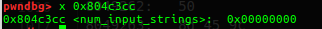

`gdb`查看可知`0x804c3cc(num_input_strings)`就是当前要读的字符串的序号,也就是当前关卡序号.

该函数还调用了`skip`函数.感觉没什么用,暂不分析.

### phase_defused

```asm
cmpl   $0x6,0x804c3cc
jne    80492c7 <phase_defused+0x89>
```

该函数首先判断了当前`num_input_strings`,只有`num_input_strings == 6`也就是第六次读入之后.可以看出这应该就是隐藏关入口.

```asm
sub    $0xc,%esp
lea    -0x5c(%ebp),%eax
push   %eax
lea    -0x60(%ebp),%eax
push   %eax
lea    -0x64(%ebp),%eax
push   %eax
push   $0x804a241
push   $0x804c4d0
call   8048810 <__isoc99_sscanf@plt>
add    $0x20,%esp
```

然后就是参数入栈,`(0x20 - 0xc) / 0x4 = 5`,共五个参数.
`sscanf`相当于以第一个字符串参数为标准输入端输入内容的`scanf`.

参数`0x804c4d0`为`0x804c3e0 + 0x50 * 3`,可知用的是第四关答案字符串.
参数`0x804a241`为字符串,`gdb`查看.

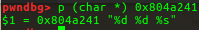

后面三个参数为对应的局部变量地址.

`sscanf`返回值为成功读入的格式化控制符对应的参数个数.

```asm
cmp    $0x3,%eax
jne    80492b7 <phase_defused+0x79>
```

这里要求三个参数都有.

```asm
push   $0x804a24a
lea    -0x5c(%ebp),%eax
push   %eax
call   8048fd6 <strings_not_equal>
```

这里调用了`strings_not_equal`函数,顾名思义.
参数为刚才的第五个参数的地址(对应`%s`)和字符串地址`0x804a24a`.`gdb`查看.

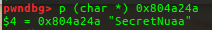

后面就是通过返回值跳转然后打印大哥字符串并调用`secret_phase`(隐藏关).
所以第四关答案应该为`<number> <number> SecretNuaa`.

## 题目

有了之前的准备就可以开始做题了.

### phase_1

```asm
push   $0x804a03c
pushl  0x8(%ebp)
call   8048fd6 <strings_not_equal>
add    $0x10,%esp
test   %eax,%eax
je     8048b4f <phase_1+0x1f>
call   80490d9 <explode_bomb>
```

第一题就是检测输入字符串是否与`0x804a03c`处字符串相同.
`gdb`查看`0x804a03c`.

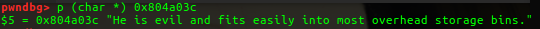

所以第一题答案为`He is evil and fits easily into most overhead storage bins.`.

成功截图.

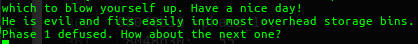

### phase_2

```asm
push   %ebp
mov    %esp,%ebp
push   %ebx
sub    $0x2c,%esp
...
mov    -0x4(%ebp),%ebx
leave
ret
```

这段代码用于创建和回收栈帧,还有调用者保护寄存器`%ebx`.

```asm
mov    %gs:0x14,%eax
mov    %eax,-0xc(%ebp)
...
mov    -0xc(%ebp),%eax
xor    %gs:0x14,%eax
je     8048bb0 <phase_2+0x5f>
call   8048790 <__stack_chk_fail@plt>
```

这段代码是程序保护机制`Canary`,用于检测栈溢出.

```asm
xor    %eax,%eax
lea    -0x24(%ebp),%eax
push   %eax
pushl  0x8(%ebp)
call   8049101 <read_six_numbers>
add    $0x10,%esp
```

函数`read_six_numbers`顾名思义.参数为一个指向栈缓冲区的指针和`input`.
调用`read_six_numbers`后先判断.

```asm
cmpl   $0x3,-0x24(%ebp)
je     8048b7d <phase_2+0x2c>
```

要求第一个数为`3`.然后执行循环体.

```asm
mov    $0x1,%ebx
mov    -0x28(%ebp,%ebx,4),%eax
add    $0x1,%eax
imul   %ebx,%eax
cmp    %eax,-0x24(%ebp,%ebx,4)
je     8048b97 <phase_2+0x46>
```

比较前一个值和后一个值,要求`a[i] = (a[i - 1] + 1) * i`.
这是一个`for`循环,检测部分如下.

```asm
add    $0x1,%ebx
cmp    $0x6,%ebx
jne    8048b82 <phase_2+0x31>
```

`%ebx`开始为`1`,跳转条件为`i != 6`.所以循环`5`次,正好检测`6`个数.

所以第二题答案为`3 4 10 33 136 685`.

成功截图.

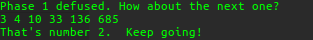

### phase_3

```asm
xor    %eax,%eax
lea    -0x10(%ebp),%eax
push   %eax
lea    -0x14(%ebp),%eax
push   %eax
push   $0x804a1e7
pushl  0x8(%ebp)
call   8048810 <__isoc99_sscanf@plt>
add    $0x10,%esp
```

函数调用`__isoc99_sscanf(input, 0x804a1e7, args...)`.
`gdb`查看`0x804a1e7`.

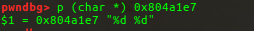

```asm
cmp    $0x1,%eax
jg     8048be8 <phase_3+0x33>
call   80490d9 <explode_bomb>
```

检测返回值是否大于`1`,可知此题答案为两个整数.

```asm
cmpl   $0x7,-0x14(%ebp)
ja     8048c29 <phase_3+0x74>
```

检测第一个数是否小于等于`7`.

```asm
mov    -0x14(%ebp),%eax
jmp    *0x804a0a8(,%eax,4)
mov    $0x3c2,%eax
jmp    8048c3a <phase_3+0x85>
mov    $0x17f,%eax
jmp    8048c3a <phase_3+0x85>
mov    $0x4ce,%eax
jmp    8048c3a <phase_3+0x85>
mov    $0xce8,%eax
jmp    8048c3a <phase_3+0x85>
mov    $0x32d,%eax
jmp    8048c3a <phase_3+0x85>
mov    $0x2e5,%eax
jmp    8048c3a <phase_3+0x85>
mov    $0x176,%eax
jmp    8048c3a <phase_3+0x85>
call   80490d9 <explode_bomb>
mov    $0x0,%eax
jmp    8048c3a <phase_3+0x85>
mov    $0x381,%eax
```

典型的`switch`结构.`gdb`查看`0x804a0a8`及后面的跳转表.

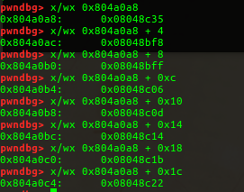

```asm
cmp    -0x10(%ebp),%eax
je     8048c44 <phase_3+0x8f>
call   80490d9 <explode_bomb>
```

之后将第二个数与之前放入`%eax`的值比较,要求相等.

所以第二题答案为`0 897`.(多解)

成功截图.

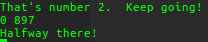

### phase_4

```asm
xor    %eax,%eax
lea    -0x10(%ebp),%eax
push   %eax
lea    -0x14(%ebp),%eax
push   %eax
push   $0x804a1e7
pushl  0x8(%ebp)
call   8048810 <__isoc99_sscanf@plt>
add    $0x10,%esp
```

和`phase_3`开头一样的调用.

```asm
cmp    $0x2,%eax
jne    8048ce7 <phase_4+0x34>
cmpl   $0xe,-0x14(%ebp)
jbe    8048cec <phase_4+0x39>
call   80490d9 <explode_bomb>
```

直接要求读两个整数,且第一个整数大小小于等于`0xe`.

```asm
sub    $0x4,%esp
push   $0xe
push   $0x0
pushl  -0x14(%ebp)
call   8048c57 <func4>
add    $0x10,%esp
```

调用`func4(-0x14(%ebp), 0, 0xe);`.

```asm
cmp    $0x6,%eax
jne    8048d09 <phase_4+0x56>
cmpl   $0x6,-0x10(%ebp)
je     8048d0e <phase_4+0x5b>
call   80490d9 <explode_bomb>
```

要求返回值等于`6`.还有第二个整数也为`6`.

由于第一个整数小于等于`0xe`.可以直接爆破.
第二种方法为解析`func4`.

```asm
mov    0x8(%ebp),%ecx
mov    0xc(%ebp),%ebx
mov    0x10(%ebp),%esi
```

首先将三个参数放置到寄存器中.(`a1`, `a2`, `a3`)

```asm
mov    %esi,%eax
sub    %ebx,%eax
mov    %eax,%edx
shr    $0x1f,%edx
add    %edx,%eax
sar    %eax
lea    (%eax,%ebx,1),%edx
```

`%edx = (a3 - a2) / 2 + a2;`.

```asm
cmp    %ecx,%edx
jle    8048c8e <func4+0x37>
```

判断`%edx`是否小于等于`a1`.

如果不,就执行下面汇编代码.

```asm
sub    $0x4,%esp
sub    $0x1,%edx
push   %edx
push   %ebx
push   %ecx
call   8048c57 <func4>
add    $0x10,%esp
add    %eax,%eax
jmp    8048cac <func4+0x55>
```

即调用`func4(a1, a2, %edx - 1)`,将返回值翻倍后跳转到函数返回阶段.

如果是,就执行下面汇编代码.

```asm
mov    $0x0,%eax
cmp    %ecx,%edx
jge    8048cac <func4+0x55>
```

返回值置`0`,然后判断`%edx`是否大于等于`a1`.如果大于进入函数返回阶段.

如果不,就执行下面汇编代码.

```asm
sub    $0x4,%esp
push   %esi
add    $0x1,%edx
push   %edx
push   %ecx
call   8048c57 <func4>
add    $0x10,%esp
lea    0x1(%eax,%eax,1),%eax
```

即调用`func4(a1, %edx + 1, a3)`,将返回值翻倍加一后跳转到函数返回阶段.

逆向成`C`语言.`v1`即`%edx`.

```c
v3 = (a3 - a2) / 2 + a2;
if ( v3 > a1 )
    return 2 * func4(a1, a2, v3 - 1);
result = 0;
if ( v3 < a1 )
    result = 2 * func4(a1, v3 + 1, a3) + 1;
return result;
```

因为结果为`6 = 2 * 3 = 2 * (2 * 1 + 1) = 2 * (2 * (2 * 0 + 1) + 1)`.

所以第四题答案为`6 6`.又之前隐藏关触发条件,所以最终答案为`6 6 SecretNuaa`.

成功截图.

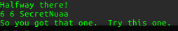

### phase_5

```asm
mov    0x8(%ebp),%ebx
...
xor    %eax,%eax
push   %ebx
call   8048fb4 <string_length>
add    $0x10,%esp
cmp    $0x6,%eax
je     8048d49 <phase_5+0x28>
call   80490d9 <explode_bomb>
```

检测`string_length(input)`返回值是否为`6`.顾名思义即要求输入字符串长度为`6`.

```asm
mov    $0x0,%eax
movzbl (%ebx,%eax,1),%edx
and    $0xf,%edx
movzbl 0x804a0c8(%edx),%edx
mov    %dl,-0x13(%ebp,%eax,1)
add    $0x1,%eax
cmp    $0x6,%eax
jne    8048d4e <phase_5+0x2d>
```

`%edx = input[%eax] & 0xf`,判断`%eax != 6`则继续循环.
然后以`%edx`为偏移量取位于`0x804a0c8`的字符数组的字符放置到`-0x13(%ebp,%eax,1)`的缓冲区字符数组中.
循环体为从第二行开始到倒数第三行.

```asm
movb   $0x0,-0xd(%ebp)
sub    $0x8,%esp
push   $0x804a09e
lea    -0x13(%ebp),%eax
push   %eax
call   8048fd6 <strings_not_equal>
add    $0x10,%esp
test   %eax,%eax
je     8048d89 <phase_5+0x68>
call   80490d9 <explode_bomb>
```

首先在缓冲区字符数组末尾加上`\0`字符,然后调用`strings_not_equal(-0x13(%ebp), 0x804a09e)`.

`gdb`查看`0x804a0c8`和`0x804a09e`.

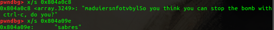

所以第五题答案为`71=657`.(多解,只要和`0xf`与之后的结果符合即可)

成功截图.

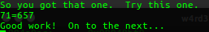

### phase_6

```asm
xor    %eax,%eax
lea    -0x3c(%ebp),%eax
push   %eax
pushl  0x8(%ebp)
call   8049101 <read_six_numbers>
add    $0x10,%esp
```

先调用`read_six_numbers(input, buffer)`.

```asm
mov    $0x0,%esi
mov    -0x3c(%ebp,%esi,4),%eax
sub    $0x1,%eax
cmp    $0x5,%eax
jbe    8048dd7 <phase_6+0x38>
call   80490d9 <explode_bomb>
```

以`%esi`为基数寄存器,检测六个数是否大于`6`,大于`6`则`bomb`.

```asm
add    $0x1,%esi
cmp    $0x6,%esi
je     8048e12 <phase_6+0x73>
```

`%esi == 6`则跳出循环.

```asm
mov    %esi,%ebx
mov    -0x3c(%ebp,%ebx,4),%eax
cmp    %eax,-0x40(%ebp,%esi,4)
jne    8048df0 <phase_6+0x51>
call   80490d9 <explode_bomb>
add    $0x1,%ebx
cmp    $0x5,%ebx
jle    8048de1 <phase_6+0x42>
jmp    8048dc6 <phase_6+0x27>
```

这一段代码遍历六个数看它们是否相等,如果相等就`bomb`.

这一段循环结束.

```asm
mov    $0x0,%ebx
mov    %ebx,%esi
mov    -0x3c(%ebp,%ebx,4),%ecx
mov    $0x1,%eax
mov    $0x804c13c,%edx
cmp    $0x1,%ecx
jg     8048dfa <phase_6+0x5b>
jmp    8048e04 <phase_6+0x65>
```

首先跳到这里,循环检测六个数,如果大于一.执行下面代码.
`gdb`查看`0x804c13c`,根据提示和代码可知这是一个`node`链表.

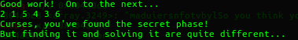

```c
struct node {
    int num;
    int id;
    struct node * next;
}
```

```asm
mov    0x8(%edx),%edx
add    $0x1,%eax
cmp    %ecx,%eax
jne    8048dfa <phase_6+0x5b>
mov    %edx,-0x24(%ebp,%esi,4)
add    $0x1,%ebx
cmp    $0x6,%ebx
jne    8048e17 <phase_6+0x78>
jmp    8048e2e <phase_6+0x8f>
```

这里按照输入的六个整数,以第`i`个整数的值来匹配`node`的`id`,将`node`的地址放置到`-0x24(%ebp,%esi,4)`缓冲区整数指针数组中.

循环结束.

```asm
mov    -0x24(%ebp),%ebx
lea    -0x24(%ebp),%eax
lea    -0x10(%ebp),%esi
mov    %ebx,%ecx
```

循环前准备.将对应缓冲区指针赋值给寄存器.

```asm
mov    0x4(%eax),%edx
mov    %edx,0x8(%ecx)
add    $0x4,%eax
mov    %edx,%ecx
cmp    %esi,%eax
jne    8048e39 <phase_6+0x9a>
```

循环体.将`node`的`num`取出放置到缓冲区中.

```asm
movl   $0x0,0x8(%edx)
mov    $0x5,%esi
```

循环前准备.以`%esi`为基数寄存器.

```asm
mov    0x8(%ebx),%eax
mov    (%eax),%eax
cmp    %eax,(%ebx)
jle    8048e62 <phase_6+0xc3>
call   80490d9 <explode_bomb>
mov    0x8(%ebx),%ebx
sub    $0x1,%esi
jne    8048e54 <phase_6+0xb5>
```

循环体.`%esi`为`0`则跳转,循环比较缓冲区数组值是否为递减序列(此时缓冲区存储的为对应`node`的`num`).

所以第六题答案为`2 1 5 4 3 6`.

成功截图.


### secret_phase

```asm
push   %ebx
sub    $0x4,%esp
call   804913b <read_line>
sub    $0x4,%esp
push   $0xa
push   $0x0
push   %eax
call   8048880 <strtol@plt>
mov    %eax,%ebx
lea    -0x1(%eax),%eax
add    $0x10,%esp
cmp    $0x3e8,%eax
jbe    8048f01 <secret_phase+0x2d>
call   80490d9 <explode_bomb>
```

先调用`read_line();`,然后`strtol(input, 0, 0xa);`将输入转换为整数.
检测输入的数是否过大,`%eax - 1 > 1000`.

```asm
sub    $0x8,%esp
push   %ebx
push   $0x804c088
call   8048e82 <fun7>
add    $0x10,%esp
cmp    $0x3,%eax
je     8048f1c <secret_phase+0x48>
call   80490d9 <explode_bomb>
```

调用`fun7(0x804c088, input_num);`.如果返回值等于`3`即可通过检测.

```asm
sub    $0xc,%esp
push   $0x804a078
call   80487c0 <puts@plt>
call   804923e <phase_defused>
add    $0x10,%esp
mov    -0x4(%ebp),%ebx
```

打印通关消息.

```asm
push   %ebx
sub    $0x4,%esp
mov    0x8(%ebp),%edx
mov    0xc(%ebp),%ecx
test   %edx,%edx
je     8048eca <fun7+0x48>
mov    (%edx),%ebx
cmp    %ecx,%ebx
jle    8048eac <fun7+0x2a>
sub    $0x8,%esp
push   %ecx
pushl  0x4(%edx)
call   8048e82 <fun7>
add    $0x10,%esp
add    %eax,%eax
jmp    8048ecf <fun7+0x4d>
mov    $0x0,%eax
cmp    %ecx,%ebx
je     8048ecf <fun7+0x4d>
sub    $0x8,%esp
push   %ecx
pushl  0x8(%edx)
call   8048e82 <fun7>
add    $0x10,%esp
lea    0x1(%eax,%eax,1),%eax
jmp    8048ecf <fun7+0x4d>
mov    $0xffffffff,%eax
mov    -0x4(%ebp),%ebx
```

转化为`C`语言.

```c
if ( !arg1 )
  return -1;
if ( *arg1 > arg2 )
  return 2 * fun7(arg1[1], arg2);
result = 0;
if ( *a1 != a2 )
  result = 2 * fun7(arg1[2], arg2) + 1;
return result;
```

`3 = 2 * 1 + 1 = 2 * (2 * 0 + 1) + 1`.

`gdb`查看`0x804c088`.

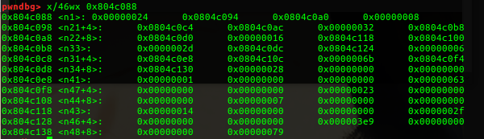

可以看出这是一个二叉树,按照条件跳转走到最后.

所以隐藏关答案为`107`.

成功截图.

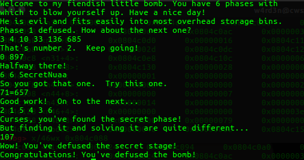