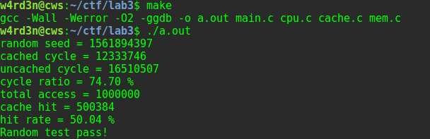

# 南京航空航天大学《计算机组成原理Ⅱ课程设计》报告

* 姓名：曹伟思
* 班级：1617302
* 学号：161730213
* 报告阶段：Lab3
* 完成日期：2019.6.30
* 本次实验，我完成了所有内容。

## 目录

[TOC]

## 思考题

### 数据对齐和存储层次结构

`cache`向内存进行读写的基本单位是`cache block`,保持变量地址对齐能尽量使该变量的数据在同一个块中.
访问一个没有对齐的存储空间时,如果存储空间分布在不同的块中,会触发二次缓存造成性能浪费.(类似`PA`种实现的跨页访存)

## 实验内容

### 实现cache

结构体与变量准备.

```c
// cache slot
typedef struct {
    uint32_t tag;
    // 标记
    uint8_t valid;
    // 有效位
    uint8_t modified;
    // 脏位
    uint8_t data[BLOCK_SIZE];
    // 数据块
} CacheSlot;

int line_of_group;
// 每组行数
int group_count;
// cache组数
int group_id_width;
// 组id长度
int tag_width;
// tag长度
CacheSlot * * cache;
// cache
```

实现`init_cache`函数.

```c
// 初始化一个数据大小为`2^total_size_width`B, 关联度为`2^associativity_width`的cache
// 例如`init_cache(14, 2)`将初始化一个16KB, 4路组相联的cache
// 将所有valid bit置为无效即可
void init_cache(int total_size_width, int associativity_width) {
    line_of_group = exp2(associativity_width);
    group_count = exp2(total_size_width) / BLOCK_SIZE / line_of_group;
    group_id_width = total_size_width - associativity_width - BLOCK_WIDTH;
    tag_width = 32 - BLOCK_SIZE - group_id_width;
    // 32bit
    cache = (CacheSlot * *)malloc(sizeof(CacheSlot *) * group_count);
    int i;
    for (i = 0;i < group_count;i++) {
        cache[i] = (CacheSlot *)calloc(line_of_group, sizeof(CacheSlot));
        // 清零
    }

    return;
}
```

实现`cache_read`函数.

```c
// 从cache中读出`addr`地址处的4字节数据
// 若缺失, 需要先从内存中读入数据
uint32_t cache_read(uintptr_t addr) {
    try_increase(1);
    uint32_t val;
    uint32_t offset;
    uint32_t group_id;
    uint32_t tag;

    addr = addr & ~0x3;
    // addr align 4
    offset = addr & ~(~0 << BLOCK_WIDTH);
    // 相对块起始位置的偏移量
    group_id = (addr >> 6) & ~(~0 << group_id_width);
    tag = (addr >> (6 + group_id_width)) & ~(~0 << tag_width);
    int i, j;
    for (i = 0;i < line_of_group;i++) {
		if (cache[group_id][i].valid && cache[group_id][i].tag == tag) {
			// 判断有效位和标记
			hit_increase(1);
			val = 0;
			for (j = 3;j >= 0;j--) {
				val *= 0x100;
				val += cache[group_id][i].data[offset + j];
			}
			// printf("step1 cache_read value: %#10x\n", val);
			return val;
		}
	}
	// 跳出循环说明命中失败
	// 遍历该组的行尝试寻找未使用的行
	for (i = 0;i < line_of_group;i++) {
		if (!cache[group_id][i].valid) {
			mem_read(addr >> BLOCK_WIDTH, cache[group_id][i].data);
			// 从内存读取数据到cache
			cache[group_id][i].tag = addr >> (BLOCK_WIDTH + group_id_width);
			cache[group_id][i].valid = 1;
			cache[group_id][i].modified = 0;
			val = 0;
			for (j = 3;j >= 0;j--) {
                val *= 0x100;
                val += cache[group_id][i].data[offset + j];
			}
			// printf("step2 cache_read value: %#10x\n", val);
			return val;
		}
	}
	// 未找到空闲行则进行随机替换
	i = rand() % line_of_group;
	if (cache[group_id][i].modified == 1) {
		// 被替换的cache行的脏位为1则需先写回到内存中
		mem_write((cache[group_id][i].tag << group_id_width) + group_id, cache[group_id][i].data);
	}
	mem_read(addr >> BLOCK_WIDTH, cache[group_id][i].data);
	// 从内存读取数据到cache
	cache[group_id][i].tag = addr >> (BLOCK_WIDTH + group_id_width);
	cache[group_id][i].valid = 1;
	cache[group_id][i].modified = 0;
	val = 0;
	for (j = 3;j >= 0;j--) {
		val *= 0x100;
		val += cache[group_id][i].data[offset + j];
	}
	// printf("step3 cache_read value: %#10x\n", val);

	return val;
}
```

实现`cache_write`函数.

```c
// 往cache中`addr`地址所属的块写入数据`data`, 写掩码为`wmask`
// 例如当`wmask`为`0xff`时, 只写入低8比特
// 若缺失, 需要从先内存中读入数据
void cache_write(uintptr_t addr, uint32_t data, uint32_t wmask) {
	try_increase(1);
	uint32_t offset;
	uint32_t group_id;
	uint32_t tag;
	uint32_t * ptr;

	addr = addr & ~0x3;
	// addr align 4
	offset = addr & ~(~0 << BLOCK_WIDTH);
	// 相对块起始位置的偏移量
	group_id = (addr >> 6) & ~(~0 << group_id_width);
	tag = (addr >> (6 + group_id_width)) & ~(~0 << tag_width);
	int i;
	for (i = 0;i < line_of_group;i++) {
		if (cache[group_id][i].valid && cache[group_id][i].tag == tag) {
			// 判断有效位和标记
			hit_increase(1);
			cache[group_id][i].modified = 1;
			ptr = (uint32_t *)&cache[group_id][i].data[offset];
			*ptr = (*ptr & ~wmask) | (data & wmask);
			// printf("step1 cache_write ok\n");
			return;
		}
	}
	// 跳出循环说明命中失败
	// 遍历该组的行尝试寻找未使用的行
	for (i = 0;i < line_of_group;i++) {
		if (!cache[group_id][i].valid) {
			mem_read(addr >> BLOCK_WIDTH, cache[group_id][i].data);
			// 从内存读取数据到cache
			cache[group_id][i].tag = addr >> (BLOCK_WIDTH + group_id_width);
			cache[group_id][i].valid = 1;
			cache[group_id][i].modified = 1;
			ptr = (uint32_t *)&cache[group_id][i].data[offset];
			*ptr = (*ptr & ~wmask) | (data & wmask);
			// printf("step2 cache_write ok\n");
			return;
		}
	}
	// 未找到空闲行则进行随机替换
	i = rand() % line_of_group;
	if (cache[group_id][i].modified == 1) {
		// 被替换的cache行的脏位为1则需先写回到内存中
		mem_write((cache[group_id][i].tag << group_id_width) + group_id, cache[group_id][i].data);
	}
	mem_read(addr >> BLOCK_WIDTH, cache[group_id][i].data);
	// 从内存读取数据到cache
	cache[group_id][i].tag = addr >> (BLOCK_WIDTH + group_id_width);
	cache[group_id][i].valid = 1;
	cache[group_id][i].modified = 1;
	ptr = (uint32_t *)&cache[group_id][i].data[offset];
	*ptr = (*ptr & ~wmask) | (data & wmask);
	// printf("step3 cache_write ok\n");

	return;
}
```

测试成功.


